# Azure VMware Solution Advanced Monitoring

## Overview

The Azure VMware Solution metrics available in the Azure portal contains standard metrics. By using the solution provided in this repository customers can extend the metrics collected to include more advanced vSphere metrics as well as NSX-T Data Center Edge and Tier-0 Gateway metrics. This solution deploys a virtual machine in Azure with a managed identity that has contributor and metrics publisher access to the private cloud object.  

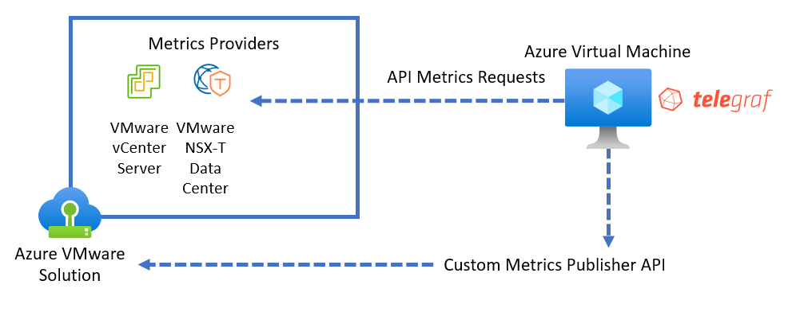

This solution has been peer reviewed but is best-effort and should be assessed and tested by the customer before using in an Azure VMware Solution production environment.

## Considerations

### Deployment 

The solution deployment requires that you select an existing vNet with network access to the vCenter Server and NSX-T Manager of an existing Azure VMware Solution Private Cloud. A new vNet cannot be created during the deployment of this solution because the new vNet would not have a connection to the private cloud. The default virtual machine sized deployed is Standard_DS1_v2, this virtual machine can be scaled if additional resources are required due to increased monitoring load. There is a 1:1 relationship between monitoring virtual machines and a private cloud. The virtual machine will need access to the internet to install the required Ubuntu packages,  GitHub to download additional packages, and the Azure monitoring public endpoints.

### Cost

The solution will deploy an Ubunutu 22.04 virtual machine of size Standard_DS1_v2. This is an additional cost that the customer subscription will be billed for. This virtual machine will also consume network traffic for both collection metrics as well as publishing metrics. The amount of traffic will vary based on the size of the private cloud as well as number of objects deployed in the private cloud.  Custom metrics also incur a cost. The costs associated with Azure Monitor are available here [Azure Monitor](https://azure.microsoft.com/en-us/pricing/details/monitor/).

## Deployment

### Option 1 - ARM Template with UI

The deployment of the solution can be done automatically via a custom template gui by following this link:

Follow the deployment wizard
 - Enter the deployment basic info

   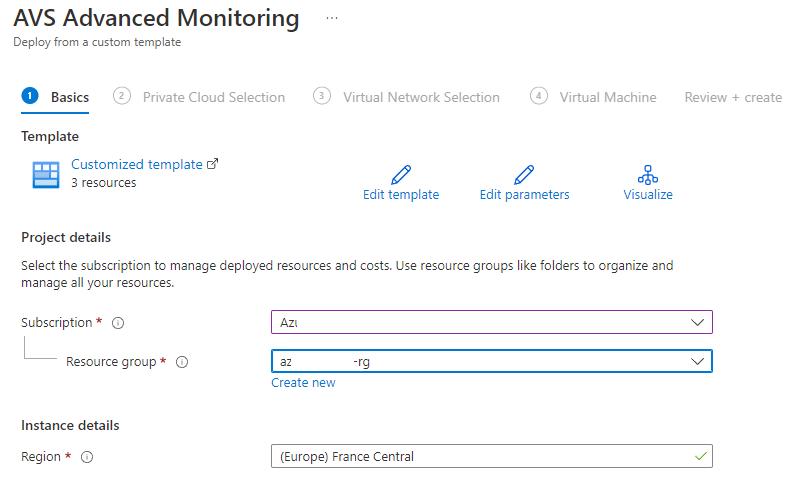

 - Select the private cloud

   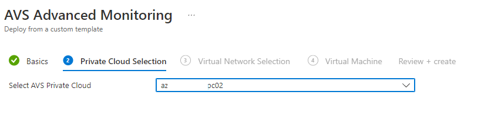

 - Select an existing vnet that has connectivity to the private cloud

   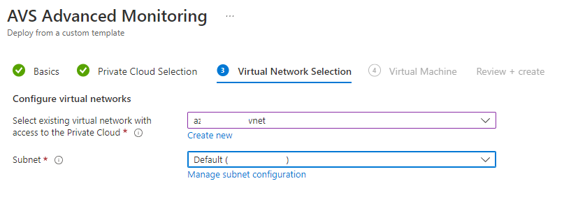  

 - Enter the virtual machine details

   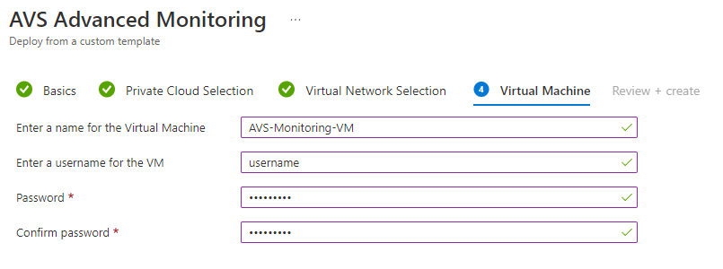

 - Complete the deployment

   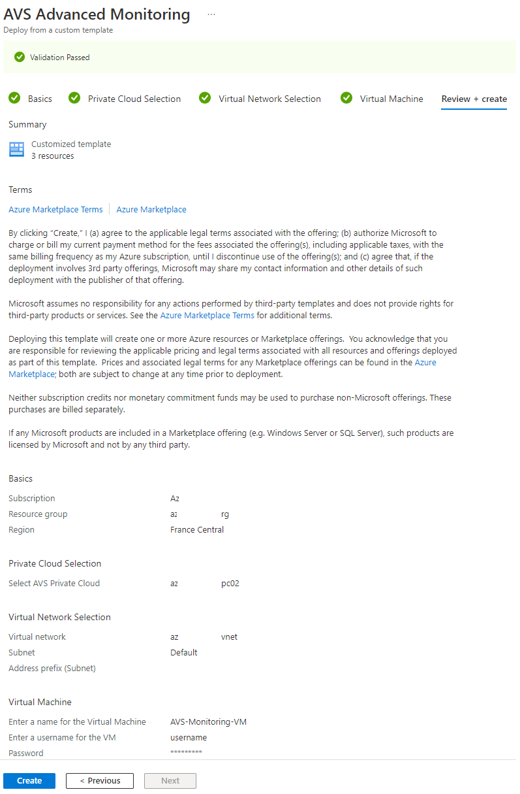

The ARM template for deployment is located here: [template.json](./Deployment/template.json)

### Option 2 - Manual

The solution can be deployed manually as well:
- Create an Ubuntu 22.04 virtual machine connected to a vNet that has access to the private cloud
- Configure an identity on the virtual machine either System or User managed
   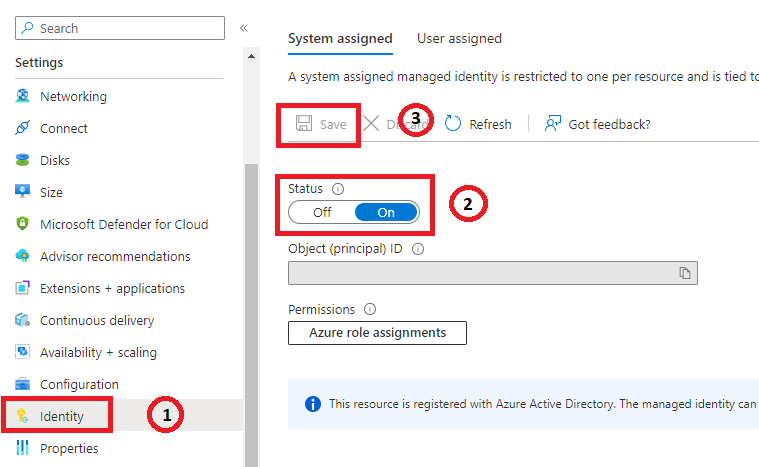

- Grant the identity the Contributor and Metrics Publisher roles on the private cloud
   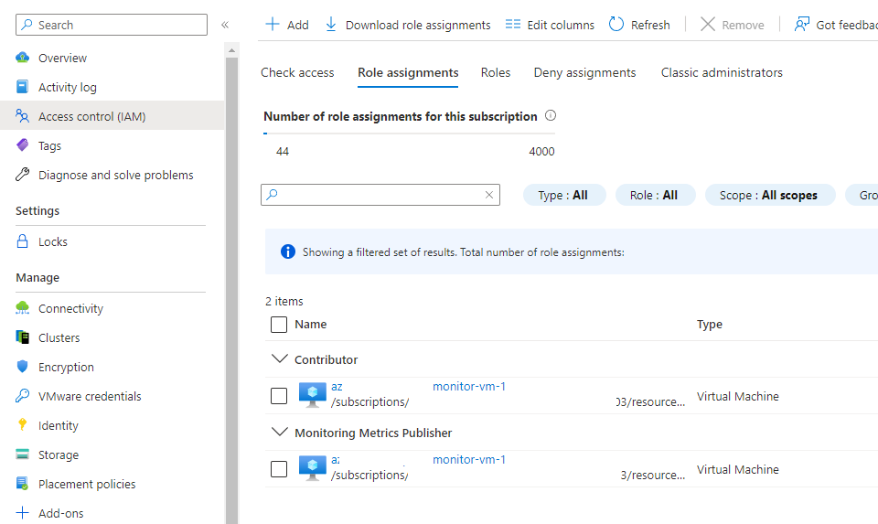

- Configure the User Data on the virtual machine as AVS_CLOUD_ID=\<AVS CLOUD RESOURCE ID\>
  The format of the resource ID is `/subscriptions/<SUBSCRIPTIONID>/resourceGroups/<RESOURCEGROUPNAME>/providers/Microsoft.AVS/privateClouds/<PRIVATECLOUDNAME>`
   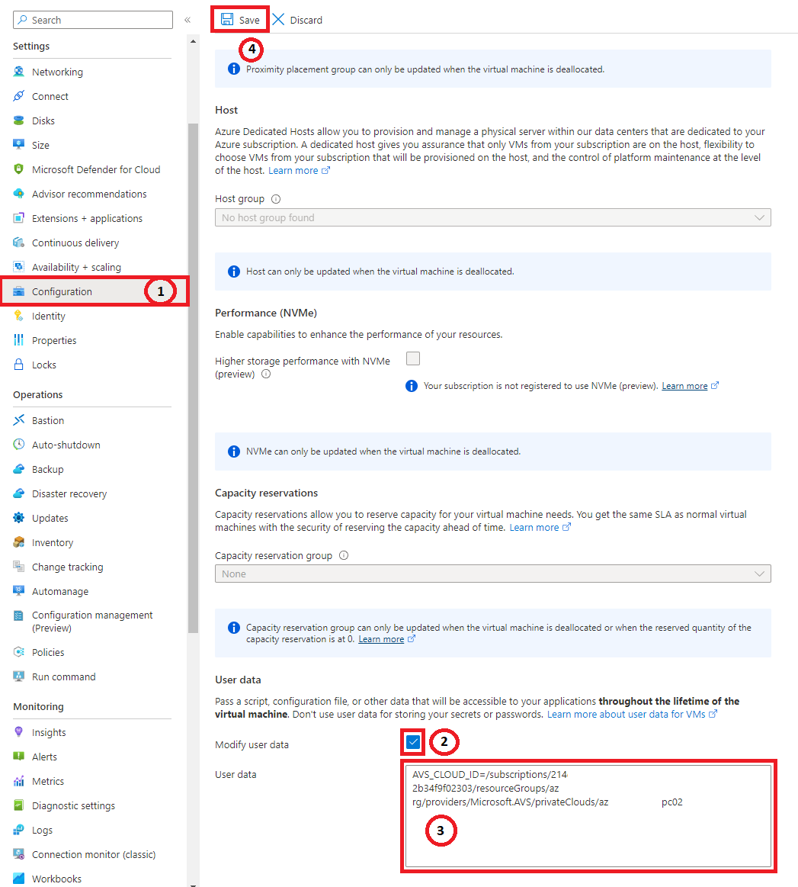

- Install the software on the virtual machine
  - `git clone https://github.com/Azure/azure-vmware-solution`
  - `cd azure-vmware-solution/advanced-monitoring/Worker/`
  - `./install.sh`
- Check status
  - `systemctl status nsx-stat`
  - `systemctl status telegraf`

    The services should be running

## Viewing Metrics

The metrics will appear on the private cloud object under the metrics tab under the telegraf namespace. The vSphere metrics will be listed as vsphere_* and the NSX-T Data Center metrics will appear under tnt##:
 - vSphere Metrics
 
   
 
 These metrics are listed at [README.md](https://github.com/influxdata/telegraf/blob/master/plugins/inputs/vsphere/METRICS.md)

 - NSX-T Data Center Metrics

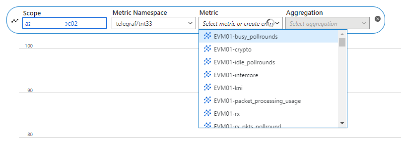

Splitting may be applied to some metrics to gain more detailed insight:
 - Per VM CPU usage

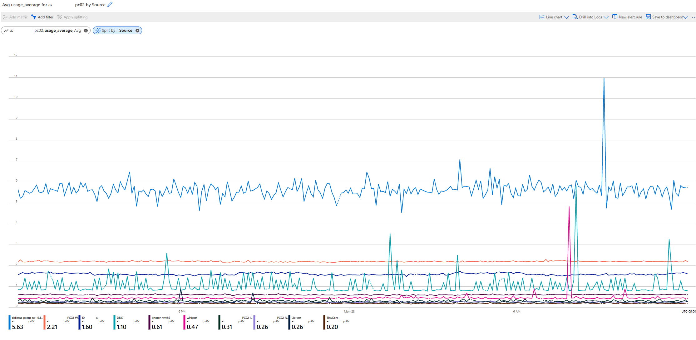

NSX-T Data Center Edge VM metrics are under the EVM## metric.  
 - Edge VM per core CPU usage

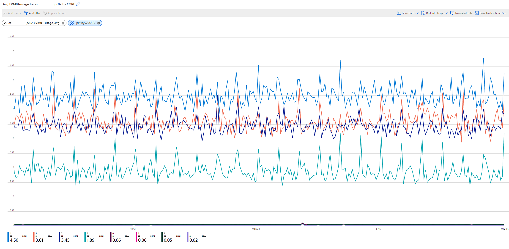

 - Edge Tier-0 Interfaces are tied to specific edge VMs. The interfaces are listed in metrics under T0-Priv0#. Each edge VM has two interfaces Priv01 and Priv03 are attached to EVM01. Interface Priv02 and Priv04 are attached to EVM02.  

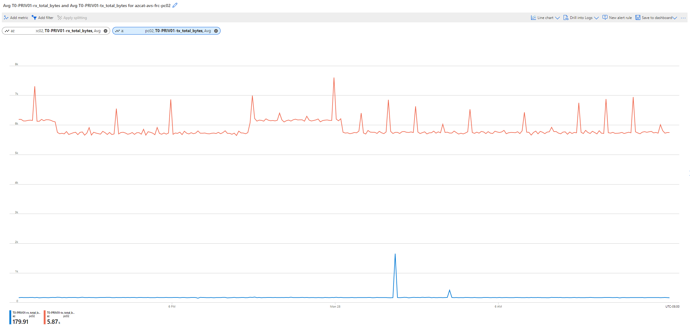
