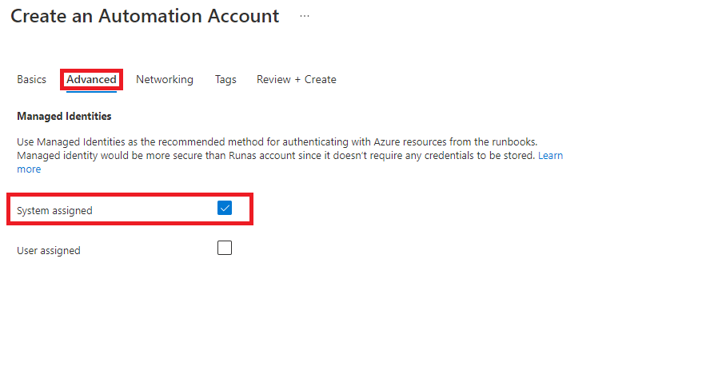
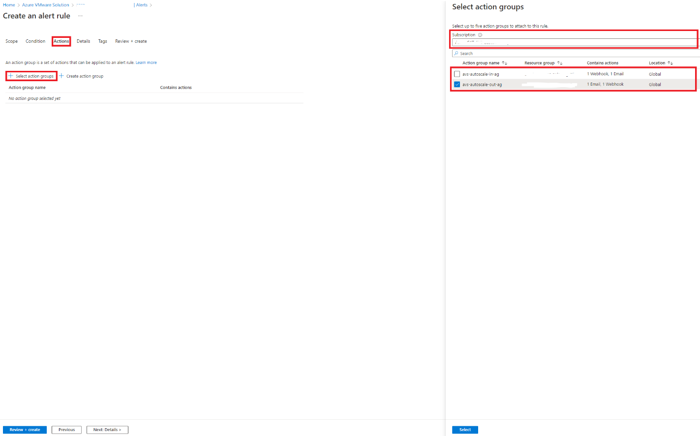

# Azure VMware Solution Auto-Scale with Azure Automation

## Overview

This Auto-Scale function allows a customer to scale their Azure VMware Solution automatically to cost effectively meet their performance goals.

The Azure VMware Solution has Azure Metrics for the percentage usage of cluster CPU, memory, and storage resources. These metrics are incorporated into Azure Alerts with thresholds for high-water mark and low-water mark values to trigger a call to an Azure Automation PowerShell Runbook via a Webhook which triggers the auto-scale event within the Azure VMware Solution private cloud.

## Operational Considerations

When Alert Rules are defined within the Azure VMware Solution, they are fired when the defined threshold is met, and the auto-scale PowerShell Runbook is executed. Once the auto-scale event has completed, the Alert condition will resolve once the Alert threshold is no longer breached and the Alert Rule will be ready to be fired again.

In addition, the cloud operations team can track the Alert lifecycle by setting the User response of Acknowledged or Closed. An automated email can also be sent to the cloud operations team each time an Alert is triggered for additional tracking.

The scale-out node add time is approximately 30min and scale-in node remove time is approximately 45min. The Azure VMware Solution private clouds and Azure Automation Accounts need to be configured within the same subscription. This mechanism supports standard and stretched clusters and supports the maximum number of clusters of Azure VMware Solution (12).

As cluster resources change, IT operations need to manually update the auto-scale alert rule percentages as per the tables below to match the node count for used CPU, memory and storage. These percentages also reflect the resource thresholds enforced by VMware vSphere HA Admission Control for cluster CPU and Memory resources.

Azure VMware Solution Standard Cluster high-water and low-water marks for auto-scale alerts.

Azure VMware Solution Stretched Cluster high-water and low-water marks for auto-scale alerts.

Note: the percentages change as the number of nodes change.

There should be a minimum one or two node (standard/stretched cluster respectively) steady-state percentage gap between the scale out alert high-water mark and the scale in alert low water mark values to avoid auto-scale flapping.

For each cluster, the CPU, memory, and storage alert monitors should be stacked within the same alert rule. Multiple clusters should not be aggregated into the same alert rule, because the alert threshold for a second cluster will not be detected when the alert is fired for the initial cluster, it would have to wait until the alert was cleared before being fired again for the second cluster. There would also be an imbalance of alert threshold percentages when the aggregate clusters have different node counts.

The alert timelines should use larger values (Aggregation Period 6, 12 or 24 hours, Frequency of Evaluation every 30 minutes or every hour) to provide the most consistent experience and avoid reacting to short term trends. During periods of planned migrations and major resource changes, alerts should be disabled to avoid auto-scale flapping.

To reduce unnecessary alerts, the scale-in alert should be disabled when the node count is 3 or 6 (cluster minimum limit standard/stretched cluster respectively) and the scale-out alert should be disabled when the node count is 16 (cluster maximum limit). When an auto-scale event is executed that violates the Azure VMware Solution limits, the PowerShell Runbook will report a Failed state.

Depending upon the customer perceived severity of an auto-scale event, the scale-in and scale-out alert severity should be selected from the Verbose, Informational, Warning, Error or Critical classifications.

## How-to Guide

### Step 1: Create an Azure Automation Account within the same Azure Subscription as the Azure VMware Solution private cloud.

1.  In the Basics tab, select the Azure Subscription, Azure Resource Group, Azure Region and enter the Automation account name.

2.  In the Advanced tab, select the System Assigned Managed Identities checkbox.

3.  In the Networking tab, select the Public access Connectivity configuration if your corporate security policies allow it. Otherwise select Private access (Private endpoint needed).

4.  In the Tags tab, configure any needed tags.

5.  In the Review & Create tab, validate the configuration and create the Azure Automation Account.

### Step 2: Create the Scale-Out and Scale-In PowerShell Runbooks within the Azure Automation Account.

1.  Delete the sample Azure Automation Runbooks, they are not needed for this procedure.

2.  Select the Create Runbook icon.

3.  In the Create Runbook window, give the Runbook a meaningful name. e.g. "Avs-Scale-Out-PS-Runbook". Select the PowerShell Runbook type, the 5.1 Runtime version and provide a meaningful description.

4.  In the Edit PowerShell Runbook window, copy the [Scale-Out PowerShell Runbook code from the code repository](https://github.com/Azure/azure-vmware-solution/blob/main/avs-autoscale/code/autoscale-out-runbook.ps1) into the main code screen without modification. Then select Save and Publish.

5.  In the Scale-Out Runbook screen, select the Webhooks object and then select Add Webhook.

6.  In the Add Webhook window, select the Create new webhook object.

7.  In the Create a new webhook screen, give the Webhook a meaningful name, set Enabled to Yes, set an Expiry date that complies with your corporate security policy and copy the URL to a secure document (this will be needed when configuring the Azure VMware Solution Scale-Out Alert). Select the OK button.

8.  In the Add Webhook window, select Configure parameters and run settings object.

9.  In the Parameters screen, make no changes and select the OK button.

10. In the Add Webhook window, select the Create button.

11. Repeat tasks 1 to 10 for the [Scale-In PowerShell Runbook](https://github.com/Azure/azure-vmware-solution/blob/main/avs-autoscale/code/autoscale-in-runbook.ps1).

### Step 3: Add Azure VMware Solution (Az.VMware) PowerShell Module to the Azure Automation Account.

1.  In the Automation Account window, select the Modules object and then select the Add a module button.

2.  In the Add a Module screen, Browse from the Gallery for the Az.VMware PowerShell Module and select the 5.1 Runtime version. Select the Import button.

### Step 4: Add Runas Service Account to the Azure Automation Account.

1.  In the Automation Account window, select the Run as accounts object and then select the Create Azure Run as Account button. Then select the Create button.

### Step 5: Add Scale-Out and Scale-In Alert Action Groups to Azure VMware Solution.

1.  In the Azure VMware Solution Alerts window, select the Alerts object and then select the Action Group button.

2.  In the Action Groups window, select the Create button.

3.  In the Basics tab, select the Azure Subscription, Azure Resource Group, Azure Region and enter the Action group name and Display name. e.g. avs-autoscale-out-ag and AvsScaleOut.

4.  In the Notifications tab, select the Email/SMS message/Push/Voice Notification type and enter a Name e.g. emailtoITOperations.

5.  Then click the Selected edit button and tick the Email box in the Email/SMS message/Push/Voice edit screen. Then enter the appropriate IT Operations email address for alert notifications to be sent to. Then select Yes for the Enable common alert schema. Then select OK.

6.  In the Actions tab, select the Webhook Action type and enter a Name e.g. avs-scale-out-webhook.

7.  Then click the Selected edit button and paste the Scale-Out webhook URI saved earlier. Then select Yes for the Enable common alert schema. Then select OK.

8.  In the Tags tab, configure any needed tags.

9.  In the Review & Create tab, validate the configuration and create the Azure VMware Solution Alert Action Group.

10. Repeat tasks 1 to 9 for the Scale-In Azure VMware Solution Alert Action Group.

### Step 6: Add Scale-Out and Scale-In Alert Rules to Azure VMware Solution for each cluster.

1.  In the Azure VMware Solution Alerts window, select the Create alert rule button.

2.  In the Condition tab, select Percentage Datastore Disk Used, Percentage CPU or Average Memory Usage Signal from the Signal name list. These three are the only signal metrics that support percentage used values.

3.  Select the Datastore or Cluster name from the Dimension name. Leave the Operator as = and then select the vsanDatastore# or Cluster-# from the Dimension values list. Only select a single cluster for each signal.

4.  In the Alert logic section, select the Static Threshold, Average Aggregation type, Greater than Operator and a Threshold value that matches the cluster type and node count for the Scale-Out high-water mark.

5.  In the Evaluation frequency section, select Check every 30 minutes or 1 hour and Look at data from the last 6 hours, 12 hours or 24 hours.

6.  If you want to trigger on multiple signals (CPU, memory and storage), then select the Add condition button and repeat tasks 2 to 5 until the desired signals are configured.

7.  In the Actions tab, press the Select action groups button.

8.  From the Select action groups screen, select the Subscription and then tick the Scale-Out Action Group name box. Press the Select button.

9.  In the Details tab, select the Azure Subscription, Azure Resource Group, Alert Rule Severity and enter the Alert rule name and description. e.g. avs-autoscale-out-cluster-1-alert-rule.

10. In the Tags tab, configure any needed tags.

11. In the Review & Create tab, validate the configuration and create the Azure VMware Solution Alert Rule.

12. Repeat tasks 1 to 11 for the Scale-In Azure VMware Solution Alert.

13. Repeat tasks 1 to 12 for each cluster.

## Troubleshooting

Step 7: Troubleshooting Azure Automation PowerShell Runbook Jobs.

1.  In the Runbook window, select the Logging and tracking object and turn Log verbose records and Log progress records to On.

2.  In the Runbook window, select the Jobs object and select specific Job to investigate. Then select the All Logs tab and scroll through the complete log.

## Testing

During testing, there may not be time to wait for the Alert to resolve and be ready to fire again. If this occurs, delete the fired alert rule and recreate.
