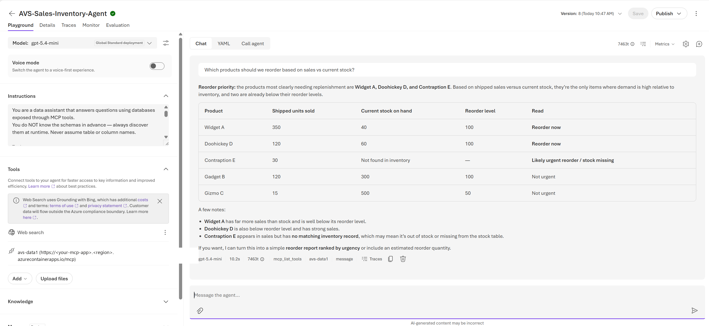
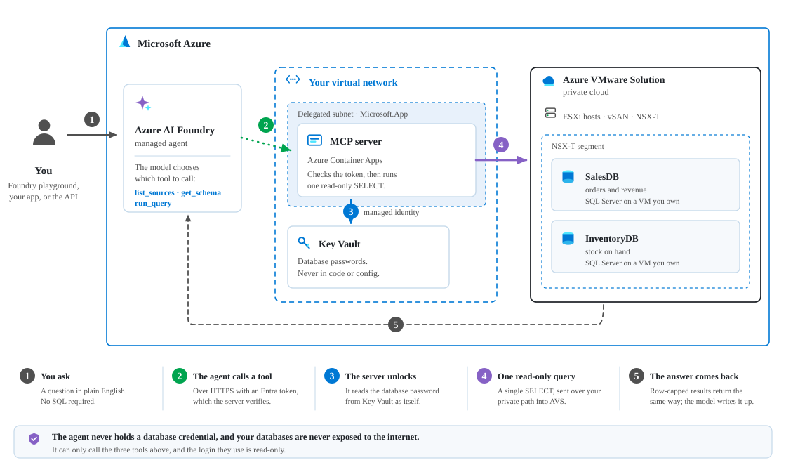
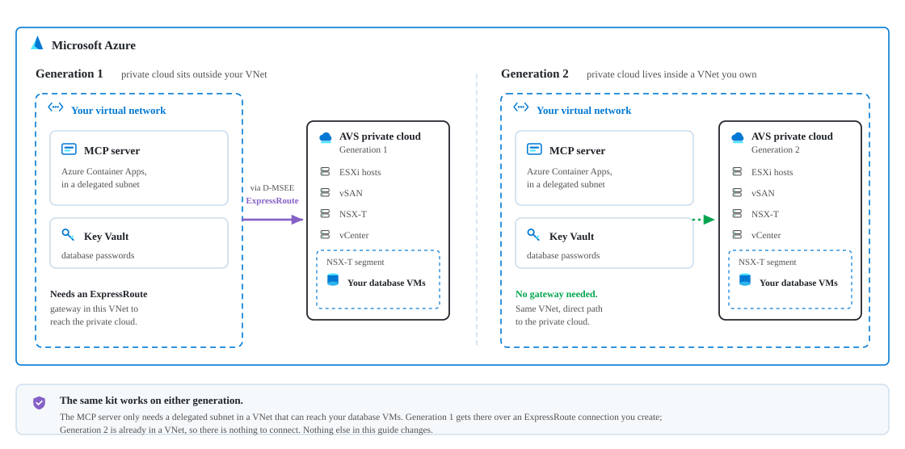
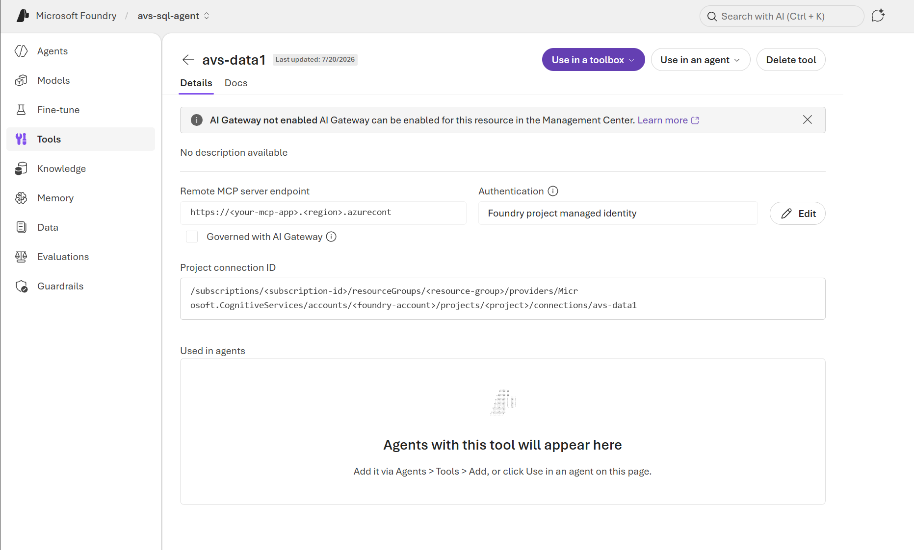
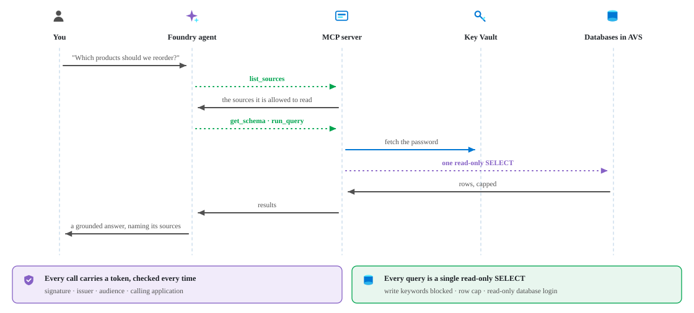

# Azure VMware Solution AI Data Agent

**Ask plain-English questions about databases running inside your Azure VMware Solution (AVS) private cloud, and get answers from an Azure AI Foundry agent — without migrating the databases, and without exposing a single one to the internet.**



The databases stay where they are. The agent reaches them through an **MCP server** running on a VNet-integrated **Azure Container App**, which connects privately to your private cloud, reads database credentials from **Key Vault** using a **managed identity**, and only accepts read-only `SELECT` statements.

> **Know what leaves your private cloud.** The databases are never migrated or exposed, but the *rows a query returns* are sent back to the Foundry agent so it can answer — and they may be retained in conversation history and traces. Scope the agent's read-only login to exactly the data you are willing to share, and review your Foundry project's data-retention settings before pointing this at regulated data.

This repository is a complete, deployable kit: infrastructure templates, the MCP server, and the step-by-step instructions below.

---

## Contents

- [How it works](#how-it-works)
- [What gets deployed](#what-gets-deployed)
- [Before you begin](#before-you-begin)
- [AVS Gen 1 and Gen 2](#avs-gen-1-and-gen-2)
- [Step 1 — Connect a VNet to your private cloud](#step-1--connect-a-vnet-to-your-private-cloud)
- [Step 2 — Register your databases](#step-2--register-your-databases)
- [Step 3 — Deploy](#step-3--deploy)
- [Step 4 — Create the read-only database login](#step-4--create-the-read-only-database-login)
- [Step 5 — Create a token audience (recommended)](#step-5--create-a-token-audience-recommended)
- [Step 6 — Create the agent and its MCP tool](#step-6--create-the-agent-and-its-mcp-tool)
- [Step 7 — Lock the endpoint to your agent](#step-7--lock-the-endpoint-to-your-agent)
- [Step 8 — Ask a question](#step-8--ask-a-question)
- [Configuration reference](#configuration-reference)
- [Security model](#security-model)
- [What it costs](#what-it-costs)
- [Clean up](#clean-up)
- [Troubleshooting](#troubleshooting)
- [Contributing](#contributing)
- [License](#license)

---

## How it works

<picture>
  <source media="(prefers-color-scheme: dark)" srcset="docs/media/diagrams/architecture-dark.svg">
  
</picture>

The agent has no database credentials and no network path of its own. It can only call three tools on the MCP server:

| Tool | What it does |
|---|---|
| `list_sources` | Lists the databases the server is allowed to read |
| `get_schema` | Returns tables and columns for one source |
| `run_query` | Runs a single read-only `SELECT` and returns row-capped results |

A real run looks like this — the model discovers the sources, reads the schemas, then issues queries:


---

## What gets deployed

`infra/main.bicep` creates everything the MCP server needs:

- a **delegated subnet** in your existing VNet (the bridge into your network)
- an **Azure Container Apps** environment + app, VNet-integrated, running the MCP server
- an **Azure Container Registry** for the server image
- a **Key Vault** holding the database password(s)
- a **user-assigned managed identity** with `AcrPull` and `Key Vault Secrets User`
- a **Log Analytics** workspace for container logs
- optionally, an **Azure AI Foundry** account, project, and model deployment

### What's in the box

| Path | Purpose |
|---|---|
| `infra/main.bicep` / `infra/main.json` | The app infrastructure. `main.json` is the compiled ARM template — use it if you don't want Bicep tooling |
| `infra/main.bicepparam` | Parameters file for `main.bicep` |
| `infra/deploy.ps1` | One command: deploy infra → build/push the MCP image → point the app at it |
| `infra/connectivity.bicep` | **Optional, AVS Gen 1 only** — creates a VNet + ExpressRoute connection to your private cloud, if you don't already have one |
| `app/` | The MCP server: `Dockerfile`, `mcp_server.py`, `requirements.txt`, `sources.yaml` |
| `docs/` | A technical write-up ([`blog.md`](docs/blog.md), also available as a [Word article](docs/Enabling-Azure-AI-for-AVS-Workloads.docx)), screenshots (`media/`), and the diagram sources (`media/diagrams/`) |

---

## Before you begin

You will need:

- **An AVS private cloud** with one or more databases running on VMs on a workload segment.
- **A VNet that can reach that private cloud** — see [Step 1](#step-1--connect-a-vnet-to-your-private-cloud).
- **Azure CLI 2.53.0 or newer**, signed in and pointed at the target subscription:
  ```powershell
  az login
  az account set --subscription <subscription-id>
  az version          # must be >= 2.53.0
  ```
  Older versions fail in confusing ways — see [Troubleshooting](#troubleshooting).
- **PowerShell 7 or newer** to run `infra/deploy.ps1` (the script declares `#Requires -Version 7`; Windows PowerShell 5.1 will refuse to run it). Install it from [here](https://aka.ms/powershell), or skip the script and deploy the template directly — see [Other ways to deploy](#other-ways-to-deploy).
- **Permissions.** The template creates **role assignments** (`AcrPull` and `Key Vault Secrets User`), which Contributor alone cannot do. You need **Owner** on the target resource group, or **Contributor + Role Based Access Control Administrator** (or User Access Administrator). Separately, Azure resource roles do **not** grant Foundry *data-plane* access: to create and run agents you also need **Foundry User** (or **Foundry Owner**) on the Foundry project — assign it after [Step 3](#step-3--deploy). To add your own Key Vault secrets you need **Key Vault Secrets Officer** on the vault. And you need the ability to create a Microsoft Entra app registration for [Step 5](#step-5--create-a-token-audience-recommended).
- **A read-only login** you can create on each database.

You do **not** need Docker installed — the image is built in Azure by `az acr build`.

> Your AVS workload segment does not need outbound internet access. It only needs to be routable from the VNet you choose. (If your VMs need internet for their own setup, such as installing SQL Server, enable it on the private cloud first.)

---

## AVS Gen 1 and Gen 2

<picture>
  <source media="(prefers-color-scheme: dark)" srcset="docs/media/diagrams/gen1-gen2-dark.svg">
  
</picture>

The agent, the MCP server, and its authentication are **generation-agnostic** — they only need IP reachability to your database VMs on their database port. `main.bicep` never references an AVS resource; it takes the name of an existing VNet, so it deploys unchanged on both generations. Only the **networking you point it at** differs:

| | Gen 1 | Gen 2 |
|---|---|---|
| How Azure reaches the private cloud | A Microsoft-managed **ExpressRoute circuit**; you connect a VNet with an ER gateway + authorization key | The private cloud is **injected into your own VNet**; no circuit or authorization key for Azure-side connectivity |
| Where the delegated `aca-subnet` goes | Any VNet connected to that circuit | The private cloud's **own VNet**, or a VNet peered to it |
| `infra/connectivity.bicep` | Use it (or *Azure vNet connect*) | **Doesn't apply** — skip it |

`connectivity.bicep` is **Gen 1 only**: it creates an ExpressRoute authorization on the private cloud and connects a gateway to `properties.circuit.expressRouteID`. A Gen 2 private cloud has no such circuit to authorize, so on Gen 2 you skip that template entirely and simply add the delegated `aca-subnet` to the private cloud's VNet (Gen 2 requires that VNet to sit in the same resource group as the private cloud). Gen 2 programs your NSX segment routes into that VNet automatically, so a Container App there can reach workload VMs with no gateway at all. If you instead place the subnet in a *peered* VNet, you may need route-table entries carrying the specific NSX segment prefixes rather than relying on the broader address space.

> This kit was validated end to end on **Gen 1** (`av36`). The Gen 2 path follows from the documented networking model but has not been exercised here.

---

## Step 1 — Connect a VNet to your private cloud

Skip this if you already have a VNet that can reach your AVS workload segment.

**Gen 2:** use the private cloud's own VNet (or one peered to it). Nothing to do here.

**Gen 1 — easiest:** in the Azure portal, open your AVS private cloud → **Connectivity** → **Azure vNet connect**, and create or select a VNet. It needs a `GatewaySubnet`; AVS wires up ExpressRoute for you.

**Gen 1 — scripted:** `connectivity.bicep` does the same end to end. It creates an ExpressRoute authorization **on the private cloud**, so it must be deployed into the private cloud's *own* resource group:

```powershell
az deployment group create -g <avs-private-cloud-rg> `
  --template-file infra/connectivity.bicep `
  --parameters avsPrivateCloudName=<your-avs-private-cloud>
```

> This takes **30–45 minutes** — an ExpressRoute gateway is slow to create. That is expected, and one-time.

`connectivity.bicep` also creates the delegated `aca-subnet`. If you use it, add `-SkipAcaSubnet` in [Step 3](#step-3--deploy) so the main template doesn't try to create the same subnet again. Otherwise, let `main.bicep` create it.

---

## Step 2 — Register your databases

Edit [`app/sources.yaml`](app/sources.yaml) and describe every database the agent is allowed to read:

```yaml
sources:
  sales:
    type: mssql            # mssql | postgresql | mysql | oracle
    connection: { host: 10.0.0.10, port: 1433, database: SalesDB }
    auth: { kind: sql, username: agentreader, secret: sql-agentreader-password }
    governance: { allow_schemas: [dbo], max_rows: 200 }   # optional: deny_tables
```

- `host` is the **private** IP or hostname of the VM on your AVS workload segment.
- `secret` is the **name of the Key Vault secret** that holds that login's password — not the password itself.
- `max_rows` caps how many rows any single query may return from this source (default 200).
- `options` (optional) is a map of extra driver parameters merged into the connection URL. SQL Server sources get `Encrypt`/`TrustServerCertificate` automatically; for other engines this is where you put TLS settings, e.g. `connection: { host: …, database: …, options: { sslmode: require } }` for PostgreSQL.
- `allow_schemas` and `deny_tables` control **what the agent is shown** by `get_schema`. They keep objects out of the model's view, which is genuinely useful for steering it — but they are *discovery filters, not access control*: `run_query` does not re-check them, so a table that is merely hidden can still be read if the model guesses its name. **Enforce real restrictions in the database**, by granting the read-only login access only to the tables (or views) you intend to expose.

For an engine other than SQL Server, also uncomment its driver in `app/requirements.txt` (`psycopg2-binary`, `pymysql`, or `oracledb`).

Onboarding another database later = add a block here, add its Key Vault secret, and rebuild the image.

---

## Step 3 — Deploy

> [!IMPORTANT]
> **`-ResourceGroup` must be the resource group that contains your VNet.** The template looks the VNet up by name inside the group it is deployed into, so it cannot reach a VNet in a different group. On the scripted Gen 1 path that means you deploy into the **AVS private cloud's** resource group — which also makes cleanup something you have to do carefully (see [Clean up](#clean-up)).

```powershell
./infra/deploy.ps1 -ResourceGroup <rg-containing-your-vnet> -ExistingVnetName <your-vnet> `
                   -Location <vnet-region> -FoundryLocation <model-region> `
                   -AcaSubnetPrefix <free-/23-inside-your-vnet> `
                   -DiscoveryMode `
                   -SqlPassword (Read-Host 'DB password' -AsSecureString)
```

This deploys the infrastructure, builds and pushes the MCP server image, and points the Container App at it.

`-AcaSubnetPrefix` defaults to `10.40.8.0/23`, which almost certainly does **not** fit your VNet. Pick a free `/23` (Container Apps requires at least that) inside your VNet's address space — check what's already taken with:

```powershell
az network vnet show -g <rg> -n <your-vnet> --query "{space:addressSpace.addressPrefixes, subnets:subnets[].{name:name, prefix:addressPrefix}}"
```

| Flag | Why you'd use it |
|---|---|
| `-Location` | The **VNet's** region. Matters when your resource group lives somewhere else |
| `-FoundryLocation` | Put Foundry in a model-rich region. The agent reaches the MCP server over public HTTPS, so it does not have to sit next to AVS |
| `-DiscoveryMode` | **Recommended for the first deploy.** See the note below |
| `-SkipAcaSubnet` | You already created `aca-subnet` (e.g. via `connectivity.bicep`) |
| `-SkipImageBuild` | Deploy infrastructure only |

> **Why `-DiscoveryMode`?** The MCP endpoint has a public ingress, so it **fails closed**: with no caller allow-list configured it answers `503` and refuses everyone — including you. But you can't populate that allow-list yet, because the agent doesn't exist and you don't know its identity.
>
> `-DiscoveryMode` breaks the deadlock. It still requires a **valid, signature-verified Entra token from your tenant** — it only relaxes the *caller allow-list* — and it logs the caller's identity so you can lock the endpoint down in [Step 7](#step-7--lock-the-endpoint-to-your-agent). **Turn it off there.**

When it finishes, `deploy.ps1` prints the values every later step refers to:

```
  MCP endpoint     : https://<app>.<region>.azurecontainerapps.io/mcp
  Foundry account  : https://<account>.services.ai.azure.com/
  {project}        : https://<account>.services.ai.azure.com/api/projects/<project>
  {armId}          : /subscriptions/<sub>/resourceGroups/<rg>/providers/Microsoft.CognitiveServices/accounts/<account>
```

`{project}` and `{armId}` are used verbatim in [Step 6](#step-6--create-the-agent-and-its-mcp-tool). `deploy.ps1` also prints the ARM deployment name so you can read them again later:

```powershell
az deployment group show -g <rg> -n <deployment-name> --query properties.outputs
# or just take the most recent deployment in the group:
az deployment group list -g <rg> --query "sort_by([?contains(name,'avs-ai-agent')],&properties.timestamp)[-1].properties.outputs"
```

### Other ways to deploy

```powershell
# Bicep + params file  (edit infra/main.bicepparam first - at minimum existingVnetName
# and acaSubnetPrefix. Requires az CLI >= 2.53.0; older CLIs don't understand .bicepparam
# and fail with "Chose only one of --template-file FILE | --template-uri URI")
az deployment group create -g <rg> --parameters infra/main.bicepparam `
  --parameters sqlPassword=<pwd> location=<vnet-region> discoveryMode=true

# Pure ARM JSON  (no Bicep tooling needed; main.json is generated from main.bicep,
# so regenerate it with `az bicep build --file infra/main.bicep --outfile infra/main.json`
# if you edit the Bicep)
az deployment group create -g <rg> --template-file infra/main.json `
  --parameters existingVnetName=<vnet> sqlPassword=<pwd> location=<vnet-region> `
               acaSubnetPrefix=<free-/23> discoveryMode=true
```

`discoveryMode=true` is the template equivalent of `-DiscoveryMode`; turn it off in [Step 7](#step-7--lock-the-endpoint-to-your-agent) exactly the same way. Add `createAcaSubnet=false` if `connectivity.bicep` already created `aca-subnet` (the equivalent of `-SkipAcaSubnet`), and set `acaSubnetPrefix` to a free /23 in your VNet — the default rarely fits.

If you deploy the template directly, you must also build the image and point the app at it:

```powershell
az acr build --registry <acrName> --image avs-mcp:v1 app
az containerapp update -n <namePrefix>-mcp-server -g <rg> --image <acrLoginServer>/avs-mcp:v1
```

---

## Step 4 — Create the read-only database login

On **each** database, create the login named in `sources.yaml`, using the password you passed as `-SqlPassword`. Grant it read access only. For SQL Server:

```sql
CREATE LOGIN agentreader WITH PASSWORD = '<the -SqlPassword value>';
USE SalesDB;
CREATE USER agentreader FOR LOGIN agentreader;
ALTER ROLE db_datareader ADD MEMBER agentreader;
```

The MCP server also rejects anything that isn't a `SELECT`, but that is a text filter and text filters can be outwitted. A genuinely read-only login means the **database** enforces it too, and the database cannot be talked out of it. Use both — and treat the grants here as the real boundary.

The template creates **one** Key Vault secret, `sql-agentreader-password`, holding the `-SqlPassword` you supplied. If every source in `sources.yaml` points at that secret name, create the same login on each instance. To give a source its own credential, add another secret to the vault and reference it from that source's `auth.secret`:

```powershell
az keyvault secret set --vault-name <keyVaultName> --name sql-inventory-password --value <password>
```

`deploy.ps1` prints `<keyVaultName>` (it carries a hash suffix); it is also the `keyVaultName` deployment output. Writing secrets needs the **Key Vault Secrets Officer** role on the vault — the vault uses Azure RBAC, so subscription Owner does not grant it by itself:

```powershell
az role assignment create --role "Key Vault Secrets Officer" `
  --assignee (az ad signed-in-user show --query id -o tsv) `
  --scope (az keyvault show -n <keyVaultName> -g <rg> --query id -o tsv)
```

---

## Step 5 — Create a token audience (recommended)

The MCP server checks the **audience** of every token it is given — but only once you tell it which audiences to accept. A dedicated app registration gives you a clean, stable one to validate against:

```powershell
$app = az ad app create --display-name "avs-mcp-audience" | ConvertFrom-Json
az ad app update --id $app.appId --identifier-uris "api://$($app.appId)"
"audience = api://$($app.appId)"
```

Keep that value for [Step 7](#step-7--lock-the-endpoint-to-your-agent).

> **Access token versions, and why the next step lists the audience twice.** A new app registration issues **v1** access tokens by default. The two versions differ in exactly the places this server checks:
>
> | | v1 token | v2 token |
> |---|---|---|
> | `iss` | `https://sts.windows.net/<tenantId>/` | `https://login.microsoftonline.com/<tenantId>/v2.0` |
> | `aud` for your API | `api://<appId>` | often the bare `<appId>` |
> | Caller identity | `appid` | `azp` (and `appid` is **empty**) |
>
> The server accepts **both** — it trusts either issuer and reads `azp` first, falling back to `appid`. That is why [Step 7](#step-7--lock-the-endpoint-to-your-agent) puts both audience forms in `ALLOWED_AUDIENCES`: you don't have to know in advance which version the caller will present, and you don't need to change the app registration. If you'd rather pin it to v2, set `requestedAccessTokenVersion` to `2` in the app registration's **Manifest** blade in the portal.
>
> Whichever you choose, take the authoritative `aud` and `azp` from the discovery log line in [Step 7](#step-7--lock-the-endpoint-to-your-agent) rather than assuming — that line reports what the caller actually presented.

> **Until `ALLOWED_AUDIENCES` is set, audience validation is switched off** — the server still verifies the token's signature and issuer, so it only accepts tokens from your tenant, but it won't care what they were issued *for*. Setting it in Step 7 is what closes that gap, so don't skip it.
>
> If your tenant restricts app registrations, or restricts which audiences you may request tokens for, you can skip this step: discovery mode logs the audience actually presented, and you can allow exactly that one instead.

---

## Step 6 — Create the agent and its MCP tool

`main.bicep` already created the Foundry account, the **project** (`foundryProjectName`), and the model deployment. All that's left is the agent and the MCP tool it calls.

Three placeholders are used throughout this step and the next. `deploy.ps1` prints the first two:

| Placeholder | Where it comes from |
|---|---|
| `{project}` | The `foundryProjectEndpoint` output — e.g. `https://<account>.services.ai.azure.com/api/projects/<project>` |
| `{armId}` | The `foundryAccountId` output — e.g. `/subscriptions/<sub>/resourceGroups/<rg>/providers/Microsoft.CognitiveServices/accounts/<account>` |
| `{projectName}` | Just the project's **name** — the last segment of `{project}`, and the `foundryProjectName` parameter you deployed with (default `avsai-project`) |

> [!IMPORTANT]
> Creating and running agents is a **Foundry data-plane** operation, and Azure resource roles don't grant it — not even Owner. Assign yourself **Foundry User** on the project first (**Foundry Owner** if you also want to manage it):
> ```powershell
> az role assignment create --role "Foundry User" `
>   --assignee (az ad signed-in-user show --query id -o tsv) `
>   --scope "{armId}/projects/{projectName}"
> ```
> In the portal this is on the project's **Access control (IAM)** blade. If agent creation returns `403` or the portal shows an empty project, this is almost always why.

### Option A — Azure AI Foundry portal

In your project, add a **tool** of type *Remote MCP server*, set the endpoint to the `mcpEndpoint` from Step 3, choose an authentication method, then attach that tool to a new agent.



The portal experience changes fairly often, and newer versions can bind the tool directly to the Foundry **project's managed identity**, which avoids managing a token at all. If your portal offers that, prefer it — it also gives the caller its own identity, which is what [Step 7](#step-7--lock-the-endpoint-to-your-agent) wants. If it doesn't, use Option B, which is what this kit was validated with.

### Option B — Create it from the API

You also need two tokens. Get them once, up front:

```powershell
# Token for the Foundry data plane (used to create and run the agent)
$foundry = az account get-access-token --resource https://ai.azure.com/ --query accessToken -o tsv
$H = @{ Authorization = "Bearer $foundry"; 'Content-Type' = 'application/json' }

# Token the MCP SERVER will accept (this is the credential you store on the connection).
# Use the audience from Step 5 if you created one:
$mcpToken = az account get-access-token --resource "api://<appId>" --query accessToken -o tsv
# ...or, if you skipped Step 5, any tenant token works while you're still in discovery mode:
# $mcpToken = az account get-access-token --resource https://management.azure.com/ --query accessToken -o tsv
```

> **Both tokens expire in about an hour.** The Foundry one only matters while you're running these commands. The MCP one is stored on the connection and is what the agent presents on every call — see [rotating it](#giving-the-tool-a-credential) below.

> [!IMPORTANT]
> The `$mcpToken` above is minted through the **Azure CLI's** client application, so its `azp` identifies the CLI — an application shared by every Azure CLI user in every tenant — and not you, your project, or your agent. That's fine to get the chain working end to end, but before you allow-list it read the warning in [Step 7](#step-7--lock-the-endpoint-to-your-agent), which shows how to give the caller a dedicated identity instead.

> **Mind which agent API you use.** `POST {project}/assistants` (threads/runs) and `POST {project}/agents` (versioned agents, *Responses* protocol) are **separate stores**, and the portal lists only `/agents`. An agent created under `/assistants` won't appear in the portal, which makes it look like nothing was created. Use **`/agents`**.

```jsonc
POST {project}/agents?api-version=v1
{
  "name": "avs-data-agent",
  "definition": {
    "kind": "prompt",                       // one of: prompt|hosted|workflow|external|voice
    "model": "gpt-5.4-mini",
    "instructions": "...",                  // see below
    "tools": [{
      "type": "mcp",
      "server_label": "avs_data",
      "server_url": "<mcpEndpoint output>",
      "allowed_tools": ["list_sources", "get_schema", "run_query"],
      "require_approval": "never",
      "project_connection_id": "avs-mcp-auth"   // recommended; see below
    }]
  }
}
```

#### Giving the tool a credential

**a. A project connection (recommended).** The credential lives on the project rather than in the agent definition, so you can rotate it without touching the agent. Create a **CustomKeys** connection whose `target` is the MCP endpoint. Note this call goes to **ARM** (`management.azure.com`), not the data plane, so it uses `{armId}` and `{projectName}` — not `{project}`. The **key name is the HTTP header name**, and the value is sent **verbatim** — so the `Bearer` prefix belongs here:

```jsonc
PUT https://management.azure.com{armId}/projects/{projectName}/connections/avs-mcp-auth?api-version=2025-06-01
{ "properties": {
    "category": "CustomKeys", "authType": "CustomKeys",
    "target": "<mcpEndpoint output>",
    "credentials": { "keys": { "Authorization": "Bearer <access token>" } } } }
```

Then reference it by name (or full ARM ID) in `project_connection_id`, as shown above.

`az rest` is the easiest way to make this call, because it attaches an ARM token for you:

```powershell
az rest --method put --url "https://management.azure.com{armId}/projects/{projectName}/connections/avs-mcp-auth?api-version=2025-06-01" --body '<the JSON above>'
```

**b. Inline.** Set `"authorization": "<access token>"` on the tool instead. Simpler for a one-off test, but it puts a secret in the agent definition and you must re-create the agent to rotate it.

Either way, an Entra access token expires (typically ~1 hour). With a connection you refresh it in one place — re-`PUT` the connection — and every agent that references it picks up the new value on its next run.

#### Instructions that actually work

This matters more than it looks. Each source is a **separate** database server, so without explicit guidance the model will emit `inventory.dbo.Products` while querying the `sales` source, get an error, and conclude the question is unanswerable instead of correlating the results itself.

```text
You answer questions using ONLY the avs_data MCP tool, which reaches SQL Server databases
running on virtual machines inside an Azure VMware Solution private cloud.
Call list_sources first, then get_schema for each relevant source, then run_query with a
single read-only SELECT. run_query takes "source" and "query".

IMPORTANT: each source is a SEPARATE database server. You cannot join across sources in
SQL, and a query naming another source will fail. To combine data, query each source
independently and correlate the results yourself, matching on the shared business key.

Never invent data. State which database each number came from.
```

#### Gotchas that cost real debugging time

- **A brand-new connection may not be usable on the very first run.** Reference it immediately after creating it and the runtime can still send *no* credential — the server logs `AUTH deny: no bearer token` and the run fails `424`, which looks exactly like a misconfigured connection. If that happens, re-`PUT` the connection, pause briefly, and run again; it then works and keeps working.
- **`authorization` takes the bare token — Foundry adds the `Bearer` prefix itself.** Including the prefix yields a doubled one, and the server rejects it with `invalid token: Invalid header padding`. Note this is the **opposite** convention to the connection `keys` value above, which is sent verbatim and *does* need the prefix.
- **`headers` is refused outright** at create time: *"Headers that can include sensitive information are not allowed in the headers property for MCP tools. Use project_connection_id instead."* Use the connection route.
- **`audience` is accepted and stored by the create call but rejected at run time** with `Unknown parameter: 'tools[0].audience'`. Don't rely on it.
- On the older `/assistants` surface, run-level `tool_resources.mcp[].headers` will **not** forward a *cryptographically valid* Entra token: the run dies with a generic `server_error` before any outbound call, while the same token with a corrupted signature — or a random string of identical length — goes through. Another reason to use `/agents`.
- With no auth configured the agent calls **anonymously**, the server correctly answers `401`, and the run fails with `Server returned 424` / `MCP Connector error … Error retrieving tool list`. A `424` therefore means *"your tool has no working credential"*, not *"the server is down"*.

---

## Step 7 — Lock the endpoint to your agent

Ask the agent one test question (the portal playground is fine). It doesn't need to produce a good answer — it only needs to reach the server. Then read the identity the server saw:

```powershell
az containerapp logs show -n <namePrefix>-mcp-server -g <rg> --type console --tail 40 | Select-String AUTH
#  -> AUTH discovery: caller azp=<GUID> aud=<audience> -- set ALLOWED_CALLERS to this azp to lock the endpoint
```

You need an actual `AUTH discovery` line. If you see `AUTH deny: no bearer token`, the tool has no working credential — fix that first ([Step 6](#step-6--create-the-agent-and-its-mcp-tool)), because locking down now would just bake in the wrong identity. No log line at all means the request never left Foundry.

Now switch the server from discovery to **enforced**:

```powershell
az containerapp update -n <namePrefix>-mcp-server -g <rg> `
  --set-env-vars ALLOWED_AUDIENCES=api://<appId>,<appId> `
                 ALLOWED_CALLERS=<azp-from-logs> `
                 DISCOVERY_MODE=false
```

- Put **both** forms of the audience in `ALLOWED_AUDIENCES` — Foundry may send the bare app ID rather than the `api://` URI, because that is what a **v2** token carries ([see the token-version note in Step 5](#step-5--create-a-token-audience-recommended)). If you skipped Step 5, use the `aud` value from the log line.
- Setting `ALLOWED_CALLERS` is what enforces the allow-list, but set `DISCOVERY_MODE=false` too, so the endpoint can never silently reopen if the allow-list is later cleared.

From now on, the server accepts calls **only** from that caller. Every request is checked for signature, issuer, audience, and caller.

> [!WARNING]
> **Don't allow-list a shared client.** If you minted the stored token with `az account get-access-token`, its `azp` is the **Azure CLI's** well-known client ID — an application shared by every Azure CLI user in every tenant. Allow-listing it means *any* user in your tenant who can run `az` can call your MCP endpoint. That is fine for a first end-to-end test; it is not fine to leave in place.
>
> For anything beyond a demo, give the caller its own identity: bind the tool to the **Foundry project's managed identity** if your portal offers it ([Step 6, Option A](#option-a--azure-ai-foundry-portal)), or create a dedicated app registration and mint the token with the client-credentials flow, so `azp` is an application only you control:
> ```powershell
> $caller = az ad app create --display-name "avs-mcp-caller" | ConvertFrom-Json
> az ad sp create --id $caller.appId | Out-Null
> $secret = az ad app credential reset --id $caller.appId --query password -o tsv
> # then request a token for your Step 5 audience and store THAT on the connection:
> $body = "client_id=$($caller.appId)&client_secret=$secret&scope=api://<appId>/.default&grant_type=client_credentials"
> $mcpToken = (Invoke-RestMethod -Method Post -Uri "https://login.microsoftonline.com/<tenantId>/oauth2/v2.0/token" -Body $body).access_token
> ```
> Set `ALLOWED_CALLERS` to `$caller.appId`. Per-agent separation requires distinct **client identities** like this — separate tokens or audiences alone don't provide it.

> `azp` identifies the **calling application**, not one specific agent — whether that's the Foundry project's identity or the client whose token you stored on the connection. Any agent in that project using the same credential is equally allowed, which is normally what you want. If you need per-agent separation, give each agent its own credential and audience.

> Environment variables are read once at process start, so these take effect on a **new revision**. `az containerapp update` creates one.

---

## Step 8 — Ask a question

Invoke the agent from the portal playground, or over the API — note the unusual path, and that **`api-version` must be omitted**:

```jsonc
POST {project}/openai/v1/responses
{ "agent_reference": { "type": "agent_reference", "name": "avs-data-agent" },
  "input": "Which products are selling well but are at or below their reorder point?" }
```

A successful run reaches across sources and tells you where each number came from:

> **Q:** Which products are at or below their reorder point? Name the database each number came from.
>
> **A:** The products at or below their reorder point are from the **inventory** database:
> - **P-1001 — Titanium Widget** — QuantityOnHand: 12, ReorderPoint: 100
> - **P-1005 — Ceramic Valve** — QuantityOnHand: 0, ReorderPoint: 25
>
> These numbers came from `inventory.dbo.Stock` for stock levels and `inventory.dbo.Products` for product names.

If the run fails, start with [Troubleshooting](#troubleshooting) — a `424` almost always means the tool has no working credential.

---

## Configuration reference

### `infra/main.bicep` parameters

| Parameter | Default | Notes |
|---|---|---|
| `existingVnetName` | *(required)* | Your VNet with connectivity to AVS. **Must be in the resource group you deploy into** |
| `acaSubnetName` | `aca-subnet` | Name of the delegated Container Apps subnet |
| `acaSubnetPrefix` | `10.40.8.0/23` | A free **/23** that fits inside your VNet's address space. The default rarely does — set it |
| `createAcaSubnet` | `true` | Set **false** (`-SkipAcaSubnet`) if `connectivity.bicep` already created `aca-subnet` — otherwise this template re-writes it, and a mismatched prefix silently reconfigures or fails it |
| `sqlUser` | `agentreader` | Default DB username, used for any source in `sources.yaml` that doesn't set its own |
| `sqlPassword` | *(required, secure)* | Read-only DB password → Key Vault (secret `sql-agentreader-password`) |
| `tenantId` | current tenant | Tenant whose tokens the MCP server will accept |
| `namePrefix` | `avsai` | Resource name prefix. Key Vault, registry and Foundry account names get a hash suffix so they stay globally unique |
| `location` | RG location | Put this in the **VNet's** region |
| `foundryLocation` | `location` | Foundry may live elsewhere — the agent reaches the MCP server over public HTTPS. Use this when the AVS region has no GPT models |
| `containerImage` | public placeholder | Swapped to your image by `deploy.ps1` |
| `deployFoundry` | `true` | Also create a Foundry account + **project** + model. The account is created with `allowProjectManagement`, without which no project can exist — and without a project you cannot create an agent at all |
| `foundryProjectName` | `<namePrefix>-project` | Foundry project that hosts the agent. Its endpoint and system-assigned principal are returned as the `foundryProjectEndpoint` / `foundryProjectPrincipalId` outputs |
| `modelName` / `modelVersion` | `gpt-5.4-mini` / `2026-03-17` | **Verify before deploying:** model availability *and lifecycle* vary by region, and a model whose `lifecycleStatus` is `Deprecating` is rejected for **new** deployments even where it still runs. Check with `az cognitiveservices model list -l <foundryLocation> --query "[?model.name=='<name>'].{v:model.version,s:model.lifecycleStatus,sku:model.skus[].name}"` |
| `allowedAudiences` / `allowedCallers` | `''` | Set after the agent exists (see [Step 7](#step-7--lock-the-endpoint-to-your-agent)) |
| `discoveryMode` | `false` | Temporarily accept any valid Entra token so you can read the caller `azp` from the logs. **Never leave this on.** |

### MCP server environment variables

Set by the template; listed here because you may need to change them later.

| Variable | Purpose |
|---|---|
| `ALLOWED_CALLERS` | Comma-separated `azp` values allowed to call `/mcp`. Empty + discovery off = fail closed (`503`) |
| `ALLOWED_AUDIENCES` | Comma-separated accepted token audiences. **Empty disables audience checking** |
| `DISCOVERY_MODE` | Relax only the caller allow-list, and log the caller identity |
| `TENANT_ID` | Tenant whose signing keys and issuer are trusted |
| `KEY_VAULT_URL` | Vault the database passwords are read from |
| `AZURE_CLIENT_ID` | Client ID of the user-assigned managed identity used for Key Vault |
| `SQL_USER` | Fallback username for sources that don't specify one |
| `SECRET_TTL_SECONDS` | How long Key Vault secrets are cached (default 3600) |
| `SQL_TRUST_SERVER_CERT` | Set `false` once your SQL Server databases present a trusted certificate |
| `HOST` / `PORT` | Listen address inside the container (default `0.0.0.0:8000`) |

### `infra/deploy.ps1` options

| Option | Default | Purpose |
|---|---|---|
| `-ResourceGroup` | *(required)* | Must contain `-ExistingVnetName` |
| `-ExistingVnetName` | *(required)* | VNet the Container App joins |
| `-Location` / `-FoundryLocation` | RG location / `-Location` | Regions for the app and for Foundry |
| `-AcaSubnetPrefix` | `10.40.8.0/23` | Free /23 inside your VNet |
| `-NamePrefix` | `avsai` | Resource name prefix |
| `-SqlPassword` | *(required)* | Read-only DB password, as a `SecureString` |
| `-AppSourcePath` | `app` | Folder containing `Dockerfile`, `mcp_server.py`, `sources.yaml` |
| `-ImageTag` | `avs-mcp:v1` | Image name:tag built into the registry |
| `-SkipAcaSubnet` | off | `aca-subnet` already exists |
| `-DiscoveryMode` | off | Deploy in discovery mode (recommended for the first run) |
| `-SkipImageBuild` | off | Deploy infrastructure only |

---

## Security model

<picture>
  <source media="(prefers-color-scheme: dark)" srcset="docs/media/diagrams/request-flow-dark.svg">
  
</picture>

- **Read-only, in two independent layers.** The server accepts only a single statement that starts with `SELECT` or `WITH`, rejects embedded semicolons, and blocks write keywords — checking the query both as written and with SQL comments stripped and whitespace normalised, so neither `SELECT *\nINTO t …` nor a keyword split by `/*…*/` can sneak past the filter. Treat that as **defence in depth, not the boundary** — a text filter can never fully model every SQL dialect. **The real boundary is the database:** grant the login `db_datareader` (or access to specific views) and nothing more, so the engine itself refuses anything else.
- **Schema filters are not access control.** `allow_schemas` / `deny_tables` shape what `get_schema` reveals; they don't restrict `run_query`. See [Step 2](#step-2--register-your-databases).
- **No secrets in code** — DB passwords live in Key Vault; the app reads them with its user-assigned managed identity and caches them for `SECRET_TTL_SECONDS` (default 1h). The connection pool is keyed on the cached secret, so a rotated password is picked up on its own once the cache expires — no restart required.
- **Entra-authenticated** — the agent presents an Entra token; the server validates its signature and issuer on **every** request, plus the audience (once `ALLOWED_AUDIENCES` is set) and the caller `azp` (once `ALLOWED_CALLERS` is set and discovery mode is off). [Step 5](#step-5--create-a-token-audience-recommended) and [Step 7](#step-7--lock-the-endpoint-to-your-agent) are what turn those last two on — until then the server accepts any valid token from your tenant.
- **Match `azp`, not `appid`** — Foundry calls the tool with a **v2** token whose `appid` claim is **empty**; the calling application's identity is carried in **`azp`**. Anything that authorizes on `appid` alone — including Container Apps **Easy Auth**, whose allowed-client-applications list matches `appid` — will therefore reject the agent no matter what you put in the list. That is why authorization is done in-app here: `AuthMiddleware` reads `azp` first and falls back to `appid` for other callers. (Easy Auth's "allow any application" toggle would sidestep the matching problem, but it also removes the caller check entirely, and many tenants disable it by policy.)
- **Fails closed** — the ingress is internet-facing, so an unset `ALLOWED_CALLERS` must never mean "allow anyone". With no allow-list the server returns `503` until you either set `ALLOWED_CALLERS` or *explicitly* opt into `discoveryMode`. Discovery mode still requires a valid, signature-verified Entra token from your tenant; it only relaxes the caller allow-list. Turn it off once you've read the `azp`.
- **Private** — reaches your databases over your VNet's private connectivity to AVS; the databases are never exposed to the internet. Note that **query results do travel back** to the Foundry agent — see the note at the top of this README.
- **Transport** — SQL Server connections use `Encrypt=yes`, defaulting to `TrustServerCertificate=yes` because AVS workload VMs typically present self-signed certificates. That encrypts the link without authenticating the server; set `SQL_TRUST_SERVER_CERT=false` once your databases use a trusted certificate. **PostgreSQL, MySQL and Oracle sources start from their driver defaults** — set their TLS parameters explicitly with the per-source `connection.options` map described in [Step 2](#step-2--register-your-databases).

---

## What it costs

There are no fixed prices here — they vary by region and by how much you use the agent. The cost drivers are:

| Component | Driver |
|---|---|
| **ExpressRoute virtual network gateway** (Gen 1 only, if you create one) | **Usually the largest line item.** Billed hourly, whether or not it's carrying traffic |
| Azure Container Apps | Billed for the running replica. The template sets `minReplicas: 1`, so **it does not scale to zero** — the server stays warm and responsive. Set `minReplicas: 0` in `main.bicep` if you'd rather trade cold starts for a lower idle bill |
| Azure AI Foundry model | Per token, per request |
| Container Registry | Basic tier, per day |
| Key Vault / Log Analytics | Per operation / per GB ingested |

If you already have connectivity from a VNet to your private cloud, the incremental cost of this kit is small. Estimate your own with the [Azure pricing calculator](https://azure.microsoft.com/pricing/calculator/).

---

## Clean up

> [!WARNING]
> **Do not blindly delete the resource group.** `main.bicep` looks up `existingVnetName` in the resource group you deploy into, so **the VNet lives in that same group**. If you followed the scripted Gen 1 path, that group is your **AVS private cloud's** resource group — deleting it would take the private cloud and your shared networking with it. Check what else is in the group before you delete anything:
> ```powershell
> az resource list -g <your-rg> --query "[].{name:name, type:type}" -o table
> ```

**If you deployed into a dedicated resource group** that contains nothing but this kit:

```powershell
az group delete -n <your-rg> --yes
```

**Otherwise, remove just what this kit created:**

```powershell
az containerapp delete       -n <namePrefix>-mcp-server   -g <rg> --yes
az containerapp env delete   -n <namePrefix>-mcp-env      -g <rg> --yes
az acr delete                -n <acrName>                 -g <rg> --yes
az keyvault delete           -n <keyVaultName>            -g <rg>     # then `az keyvault purge` to release the name
az identity delete           -n <namePrefix>-mcp-identity -g <rg>
az monitor log-analytics workspace delete -n <namePrefix>-logs -g <rg> --yes
az cognitiveservices account delete -n <foundryName>      -g <rg>     # this also removes its projects, agents and connections

# ONLY if this deployment created the subnet (i.e. you did NOT use -SkipAcaSubnet):
az network vnet subnet delete --vnet-name <vnet> -n aca-subnet -g <rg>
```

`<acrName>`, `<keyVaultName>` and `<foundryName>` carry a hash suffix — read them from the deployment outputs (see [Step 3](#step-3--deploy)) rather than guessing.

These are **not** removed by the resource-by-resource path, and survive `az group delete` too if they live elsewhere:

- The **agent and its connection**, if you are keeping the Foundry account. Deleting the account removes them with it; otherwise:
  `DELETE {project}/agents/avs-data-agent?api-version=v1` and
  `DELETE https://management.azure.com{armId}/projects/{projectName}/connections/avs-mcp-auth?api-version=2025-06-01`
- The **app registration** from Step 5, and any dedicated caller app from Step 7 — these live in Entra ID, not in any resource group: `az ad app delete --id <appId>`
- Anything **`connectivity.bicep`** created: the VNet, the ExpressRoute gateway and connection, and the **ExpressRoute authorization on the private cloud itself**. On the scripted Gen 1 path these sit in the *same* resource group you deployed into, alongside the private cloud — which is exactly why you must not delete that group wholesale. The gateway is the expensive one; delete it first if you are cleaning up for cost.

---

## Troubleshooting

- **`403` creating an agent, or the project looks empty in the portal:** you have Azure resource permissions but not Foundry **data-plane** ones. Assign yourself **Foundry User** on the project — see [Step 6](#step-6--create-the-agent-and-its-mcp-tool). Owner on the subscription does not imply it.
- **`503` / "server is not locked down":** `ALLOWED_CALLERS` is empty and discovery mode is off. This is deliberate — set `allowedCallers`, or deploy once with `discoveryMode=true` to learn the `azp`.
- **`401 unauthorized` after locking:** the token's `azp` doesn't match `ALLOWED_CALLERS`. Re-check the discovery log line, or redeploy with `discoveryMode=true` to re-enter discovery.
- **`401 unauthorized` while the tool *is* configured:** the `aud` Foundry sends may be the **bare app ID**, not the `api://` URI. Put **both** forms in `ALLOWED_AUDIENCES` (`api://<appId>,<appId>`).
- **The agent you created isn't in the portal:** you almost certainly created it under `/assistants`. The portal lists the `/agents` collection — they are separate stores. Re-create it with `POST {project}/agents` (see [Step 6](#step-6--create-the-agent-and-its-mcp-tool)).
- **`GET {project}/agents` looks empty:** the response is an **OpenAI-style envelope** — the agents are in `data` (with `first_id` / `last_id` / `has_more`), *not* in ARM's usual `value`. Reading `.value` yields zero agents and makes it look like nothing was created.
- **Run fails with `MCP Connector error. Http status: 424 …` or `Server returned 424`:** Foundry reached the server but couldn't list tools — nearly always because the tool has **no working credential**, so it called anonymously and got the server's `401`. Confirm the direction from the server side: a `401` in the container logs means the request arrived; *no* log line at all means Foundry never called out.
- **`AUTH deny: invalid token: Invalid header padding`:** you included the `Bearer` prefix in the tool's `authorization` property. It takes the **bare token** — Foundry adds the prefix itself.
- **`AUTH deny: no bearer token` when the tool uses `project_connection_id`:** the connection was created moments earlier. The agent runtime resolves connections with a short lag; until it does, it calls anonymously and you get a `424`. Pause after the `PUT`, then re-run.
- **`Unknown parameter: 'tools[0].audience'` at run time,** even though the create call accepted `audience`: the management and runtime schemas disagree. Drop `audience`.
- **Run fails with a bare `server_error` and nothing reaches the server:** you are passing a real Entra token in `tool_resources.mcp[].headers` on the older `/assistants` surface. Foundry blocks forwarding valid Entra tokens there — use `/agents` with `authorization`, or a project connection.
- **Env-var changes appear to do nothing:** the app reads its configuration once at process start, so `ALLOWED_CALLERS` / `ALLOWED_AUDIENCES` / `DISCOVERY_MODE` only take effect on a **new revision**. Redeploy, or restart the revision.
- **Container App stuck `InProgress` with no revisions:** almost always the image pull. The template uses a **user-assigned** identity precisely so `AcrPull` exists *before* the app is created; a system-assigned identity deadlocks (the role assignment needs the app's principal, the app needs the role to start).
- **`ModuleNotFoundError: No module named 'mcp.server.fastmcp'`:** you built with an unpinned MCP SDK. `requirements.txt` pins `mcp[cli]<2` because the 2.x SDK renamed `FastMCP`.
- **No container logs anywhere:** the environment must have `appLogsConfiguration`. The template creates a Log Analytics workspace and wires it up; a revision created *before* that config was added must be restarted to start shipping logs. Query with:
  `az monitor log-analytics query -w <workspaceGuid> --analytics-query "ContainerAppConsoleLogs_CL | where ContainerAppName_s == '<app>' | order by TimeGenerated desc | take 50"`
- **`az acr build` fails on Windows with `UnicodeEncodeError`:** a client-side log-streaming bug (colorama/cp1252). **The server-side build usually succeeded** — confirm with `az acr repository show-tags -n <acr> --repository avs-mcp` before rebuilding. `deploy.ps1` sets `PYTHONIOENCODING=utf-8` and verifies the tag rather than aborting.
- **Azure CLI too old.** Versions before 2.53.0 pin the `Microsoft.App` API to `2022-10-01`, which predates Container Apps *workload profiles*. `az containerapp update` then fails with `WorkloadProfilePropertyNotSupportedInApiVersion`, and `az containerapp show` reports `workloadProfiles: null` and an empty `workloadProfileName` **even when they are set correctly** — which makes triage actively misleading. Upgrade with `az upgrade`, or read the app directly: `az rest --method get --url "<appResourceId>?api-version=2024-03-01"`.
- **Cancelling a stuck deployment doesn't help:** cancelling the ARM deployment does **not** cancel the underlying Container Apps operation. Later deploys then fail with `ContainerAppOperationInProgress`; wait for it to settle, then delete the app and redeploy.
- **`Login timeout expired` from `get_schema` or `run_query`:** the server reached the point of opening a database connection but got no answer. Either `sources.yaml` still contains the shipped placeholder hosts (`192.168.x.x`) and you rebuilt the image without editing it, or the host is genuinely unreachable from the Container Apps subnet. Check the value the image was built with, then confirm the path — the VNet must be connected to the private cloud, and the NSX segment must route back to the `aca-subnet` prefix.
- **`Query error: Invalid column/object name`:** the agent guessed a name — its instructions tell it to call `get_schema` first; the server also returns the available objects as a hint.
- **Connectivity deploy is slow:** the ExpressRoute gateway in `connectivity.bicep` takes ~30–45 minutes. This is expected and one-time.

---

## Contributing

Issues and pull requests are welcome in the [Azure VMware Solution repository](https://github.com/Azure/azure-vmware-solution). If you exercise the **Gen 2** path, or add a driver for another database engine, please open a PR — those are the two most valuable gaps.

This project follows the [Microsoft Open Source Code of Conduct](../CODE_OF_CONDUCT.md), and contributions require agreeing to the [Microsoft CLA](https://cla.opensource.microsoft.com). To report a security issue, follow [SECURITY.md](../SECURITY.md) rather than opening a public issue.

## License

Licensed under the [MIT License](../LICENSE).

> This project is a sample. It is provided as-is, without warranty or support, and it is not a Microsoft product or service. Review it against your own security and compliance requirements before using it with production data.
