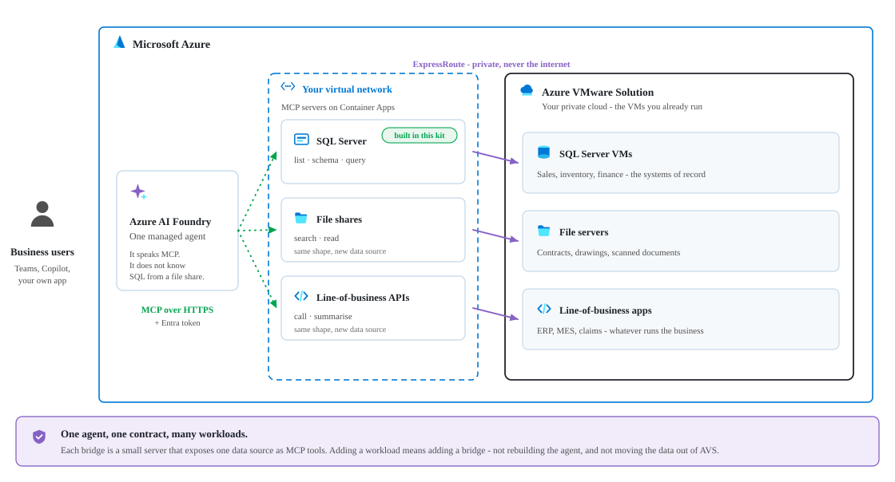
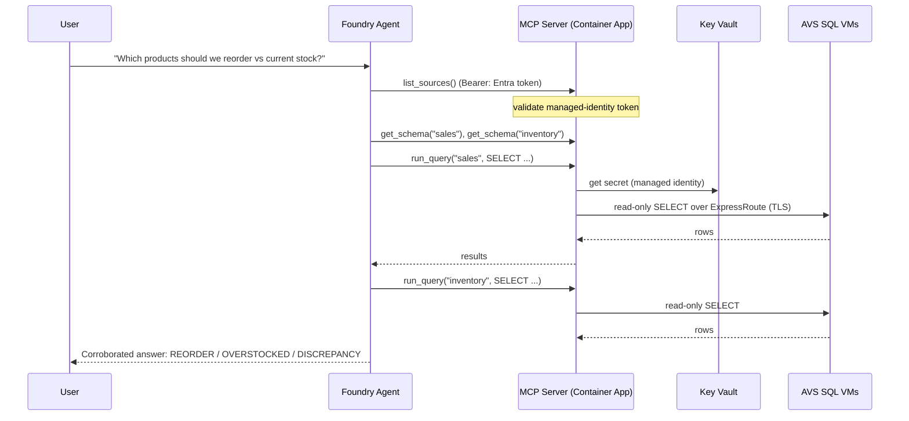

# Enabling Azure AI for Azure VMware Solution workloads

*Bring Azure AI to the workloads running inside your AVS private cloud — databases, file shares, line-of-business apps, and more — by placing a small Model Context Protocol (MCP) server in front of each. Secure, in place, read-only, and without moving your data or exposing it to the internet.*

Organizations move their VMware estates to **Azure VMware Solution (AVS)** so they can modernize on their own terms — lifting and shifting mission-critical applications into Azure without rewriting them. But that same "don't change it" advantage has a side effect: the systems that hold your most valuable data — core databases, file servers, and line-of-business applications — run on private networks inside the private cloud, out of reach of the Azure-native AI services that could bring them to life.

Azure AI Foundry, Microsoft Copilot, and AI agents live in the Azure control plane and, by default, reach only public endpoints. So when teams set out to "add AI everywhere," the workloads in AVS are often the exception — not because the data isn't valuable, but because it's private by design.

This post shows a **repeatable pattern that closes that gap for any workload**: a managed Azure AI Foundry agent that reaches private AVS systems through lightweight **MCP servers** — one small bridge per workload type. Each new workload you want to make AI-accessible — a database today, a file share or an API tomorrow — is **one more MCP server**, behind the same agent, the same identity, and the same governance. We prove it end to end with private SQL databases, then show how the very same pattern extends to the rest of your estate — with **no data leaving your network, no credentials in code, and read-only access enforced end to end.**

> **Get the code:** the full deployment kit — Bicep/ARM templates, the MCP server, and a one-command deploy script — is on GitHub at [**AVS-workload-agent**](https://github.com/nivasn-msft/AVS-workload-agent).

## Solution overview

One managed agent in Azure AI Foundry talks to your private AVS workloads through a set of small **MCP servers** — one per workload type. SQL databases are live today; a file-share bridge or an API bridge is *the same pattern with different tools*.

<picture>
  <source media="(prefers-color-scheme: dark)" srcset="./media/diagrams/workload-pattern-dark.svg">
  
</picture>

Three ideas carry the design:

1. **Model Context Protocol (MCP) is the universal contract.** Every workload is exposed through the same small set of tools (for the SQL bridge: `list_sources`, `get_schema`, `run_query`). The agent learns one way to ask; each MCP server translates it to its workload.
2. **One lightweight bridge per workload type.** Each MCP server is a VNet-integrated Azure Container App that can legally see *both* worlds — Azure and the private AVS network over ExpressRoute. Want to make another workload AI-accessible? **Add another MCP server** — no change to the agent.
3. **Managed identity end-to-end** — no passwords in code or config; the agent presents an Entra token, and each server pulls the credentials it needs from Key Vault.

The rest of this post proves the pattern with a working SQL example — two private databases behind one MCP server — and then shows how the same bridge extends to file shares, APIs, and beyond.

---

## One pattern, every workload

The power of the design is that it is **workload-agnostic**. The agent, the network path, the Entra identity, and the governance model are built **once**; each new workload is just a new MCP server that speaks the same tool contract. You light up your estate incrementally — highest-value workloads first — without re-architecting anything.

| AVS workload | MCP bridge | Example tools | What it unlocks |
|---|---|---|---|
| **SQL databases** (SQL Server, PostgreSQL, Oracle, MySQL) | SQL MCP server *(live in this post)* | `list_sources`, `get_schema`, `run_query` | Natural-language questions and cross-database corroboration |
| **File shares** (SMB / NFS, document stores) | File MCP server | `list_dirs`, `search`, `read_file` | Q&A and summarization over contracts, drawings, PDFs, logs |
| **Line-of-business apps** (REST / SOAP) | API MCP server | `list_operations`, `call_operation` | Conversational access to ERP, ticketing, claims, orders |
| **NoSQL / message systems** | Connector MCP server | `list_collections`, `query`, `peek` | Reasoning over document stores and event streams |
| **Mainframe / other systems** | Adapter MCP server | workload-specific | Bringing legacy systems into modern AI workflows |

Every bridge is small, independently deployable, and governed the same way: read-only by default, private over ExpressRoute, and locked to your agent's managed identity. **The pattern is the product; the MCP servers are how you grow it.**

Everything that follows — network, identity, governance, deployment — is reused unchanged by every MCP server you add. To make it concrete, here is the first proof of the pattern: a secure, read-only agent over two private SQL databases in AVS.

---

## Reference architecture

The reference deployment runs in a single Azure region (Canada East), with the Azure resources in one resource group alongside the AVS private cloud.

| Component | Resource | Type |
|---|---|---|
| AVS private cloud | `avs-private-cloud` | `Microsoft.AVS/privateClouds` |
| MCP server | `avs-mcp-server` | `Microsoft.App/containerApps` |
| Container Apps env | `avs-mcp-env` | `Microsoft.App/managedEnvironments` |
| AI Foundry account | `avs-sql-foundry` | `Microsoft.CognitiveServices/accounts` |
| Foundry project | `avs-sql-foundry/avs-sql-agent` | `.../accounts/projects` |
| Container registry | `avssqlacr` | `Microsoft.ContainerRegistry/registries` |
| Secrets | `avs-sql-kv-01` | `Microsoft.KeyVault/vaults` |
| Network | `avs-hub-vnet` (10.40.0.0/16) | `Microsoft.Network/virtualNetworks` |
| ExpressRoute gateway | `avs-ergw` (+ `-conn`) | `virtualNetworkGateways` / `connections` |
| Foundry private endpoint | `avs-sql-foundry-pe` (+ 3 privatelink DNS zones) | `privateEndpoints` |
| Jump host | `Jumpbox` (10.40.1.4) | `Microsoft.Compute/virtualMachines` |
| Logs | `avs-sql-logs` | `OperationalInsights/workspaces` |

**Data VMs** (inside the AVS private cloud, NSX segment `avs-workload-01`, 192.168.131.0/24):

| VM | IP | Database |
|---|---|---|
| SQL VM #1 | `192.168.131.55` | `SalesDB` (Products, Customers, Orders) |
| SQL VM #2 | `192.168.131.56` | `InventoryDB` (Products, Stock) |

---

## Network topology

The bridge works because the Container Apps subnet routes to the AVS private cloud over ExpressRoute, while Foundry is reachable privately via a private endpoint.

<picture>
  <source media="(prefers-color-scheme: dark)" srcset="./media/diagrams/topology-dark.svg">
  
</picture>

Key points:
- The **MCP server** runs in a delegated **`aca-subnet`** and reaches the workload segment over ExpressRoute.
- **Foundry** has a **private endpoint** (`avs-sql-foundry-pe`) with three `privatelink` DNS zones (`cognitiveservices`, `services.ai`, `openai`) so the jumpbox/portal can reach it privately; inbound public access can be locked to an IP allow-list.
- The **managed agent's tool call** to the MCP server is an outbound HTTPS call carrying an Entra token.

---

## The data bridge: the SQL MCP server

This is the first bridge — the **SQL MCP server**. A small Python service (FastMCP, `streamable-http`) exposes three read-only tools; it is engine-agnostic (SQLAlchemy) and pulls credentials from Key Vault at runtime. A file-share or API bridge has the *same shape* — a small container, an Entra-validated endpoint, and a handful of read-only tools — with connectors suited to its workload.

```python
@mcp.tool()
def list_sources() -> str:
    """List the databases across the AVS workloads and what each contains."""

@mcp.tool()
def get_schema(source: str) -> str:
    """Return tables and columns for a source (call list_sources first)."""

@mcp.tool()
def run_query(source: str, query: str) -> str:
    """Run ONE read-only SELECT and return up to the source's row cap."""
```

**Guardrails:** only `SELECT` / `WITH`, single statement, DML/DDL keywords blocked, results row-capped. The agent gets to *read and reason* — never to mutate.

**Deployment:** containerized (ODBC Driver 18 + `msodbcsql18`), pushed to `avssqlacr`, and run on the VNet-integrated `avs-mcp-env`. The Container App has a **system-assigned managed identity** with **Key Vault Secrets User** on `avs-sql-kv-01`.

**Config-driven catalog** (`sources.yaml`) — onboarding a database is config, not code:

```yaml
sources:
  sales:
    type: mssql
    connection: { host: 192.168.131.55, port: 1433, database: SalesDB }
    auth: { kind: sql, username: agentreader, secret: sql-agentreader-password }
    governance: { allow_schemas: [dbo], max_rows: 200 }
  inventory:
    type: mssql
    connection: { host: 192.168.131.56, port: 1433, database: InventoryDB }
    auth: { kind: sql, username: agentreader, secret: sql-agentreader-password }
    governance: { allow_schemas: [dbo], max_rows: 200 }
```

---

## The managed agent in Azure AI Foundry

The agent lives entirely in **`avs-sql-foundry` / project `avs-sql-agent`** (model `gpt-5.4-mini`). It's configured with:
- **Instructions** that force a schema-first workflow (discover sources → read schema → write read-only SQL → corroborate).
- An **MCP tool** pointing at the Container App's `/mcp` endpoint, authenticated with **Microsoft Entra / Project Managed Identity**.

Generic, source-agnostic instructions (the productizable version) tell the agent to *discover* structure at runtime rather than hard-coding any schema — so the same agent works against **any workload behind an MCP server**, not just these databases.


*Figure 1: The managed agent in Azure AI Foundry, with the private MCP data server attached as a tool and authenticated via managed identity.*

---

## How a question becomes an answer

<picture>
  <source media="(prefers-color-scheme: dark)" srcset="./media/diagrams/request-flow-dark.svg">
  
</picture>

<details>
<summary>The same exchange as a sequence diagram</summary>



</details>

---

## Security and governance

- **No secrets in code** — SQL credentials live in `avs-sql-kv-01`; the server fetches them via its managed identity (`DefaultAzureCredential` → `SecretClient`).
- **Entra managed-identity auth** from the agent to the server — no shared keys, tokens auto-rotate.
- **Private connectivity** — the server reaches AVS over ExpressRoute; the SQL VMs are never exposed to the internet; Foundry is fronted by a private endpoint.
- **Read-only guardrails** — only `SELECT` is allowed; writes/DDL blocked; result sets capped.
- **Least-privilege caller lock** — the server accepts tokens **only** from the Foundry project's managed identity.

---

## The payoff: corroboration across silos

The value isn't "query a table" — it's **corroboration** a single database can't do. Two databases share a `ProductID`; the agent queries **both** and joins them itself:

> **Widget A** — sold 500, stock 40 (below reorder 50) → **REORDER NOW**
> **Gizmo C** — high stock, low sales → **OVERSTOCKED**
> **Contraption E** — in Sales, missing from Inventory → **DISCREPANCY**


*Figure 2: A natural-language question answered from two private AVS databases, with reorder, overstock, and discrepancy flags.*


*Figure 3: The run trace — every tool call and query is visible and auditable (`list_sources` → `get_schema` → `run_query` on each source).*

The same pattern generalizes: *claims vs policy*, *orders vs fulfillment*, *tickets vs assets*.

---

## Adding the next workload

Growing coverage happens at two levels — **within** a bridge and **across** bridges.

**Within the SQL bridge** (another database), it's config, not code:
1. **SQLAlchemy** gives one code path for SQL Server, PostgreSQL, MySQL, and Oracle — the source `type` selects the dialect.
2. **Config-driven catalog** — onboard a database with a YAML block + a Key Vault secret.
3. **Governance layer** — per-source allow/deny schemas, row caps, and optional column masking.

Adding a PostgreSQL VM, for example, requires **no `mcp_server.py` changes** — add `psycopg2-binary`, a source block (`type: postgresql`, `allow_schemas: [public]`), and a secret, then rebuild.

**Across workload types** (a file share, an API), you add a **new MCP server** that implements the same tool contract with connectors suited to that workload — `read_file` / `search` for a document store, `call_operation` for a REST or SOAP app — then attach it to the same agent. Nothing about the agent, the network, or the identity model changes. The estate lights up **one MCP server at a time**.

---

## How it's deployed

```powershell
# Build + push the MCP image
$acr = az acr list -g avs-sql-rg --query "[0].name" -o tsv   # avssqlacr
az acr build --registry $acr --image avs-mcp:v4 .

# Deploy to the VNet-integrated Container Apps environment
az containerapp update -n avs-mcp-server -g avs-sql-rg `
  --image "$acr.azurecr.io/avs-mcp:v4"

# Grant the app's managed identity access to Key Vault (Secrets User)
# Store the read-only SQL credential
az keyvault secret set --vault-name avs-sql-kv-01 `
  --name sql-agentreader-password --value '<password>'
```

In the Foundry portal: create the agent (model `gpt-5.4-mini`), attach the MCP tool (`https://avs-mcp-server.<env>.canadaeast.azurecontainerapps.io/mcp`, **Microsoft Entra / Project Managed Identity**), and test in the playground.

**Deploy it yourself.** The entire bridge is packaged as an open, reusable kit on GitHub — [**AVS-workload-agent**](https://github.com/nivasn-msft/AVS-workload-agent) — with a Bicep template (and a compiled ARM JSON equivalent), a parameters file, and a one-command deploy script. It provisions the delegated subnet, the container registry, Key Vault (with the read-only secret), the VNet-integrated Container Apps environment and MCP server, and the managed-identity role assignments — optionally including the Azure AI Foundry account and model deployment. You point it at your existing VNet (the one connected to your AVS private cloud) and supply a read-only database credential; the script builds and pushes the MCP image and wires up the app. All that remains is creating the read-only database login and attaching the MCP tool to your agent in the portal.

---

## What's next

- **Meet users where they are** — surface the agent in **Microsoft Teams or Microsoft 365 Copilot** so the whole organization can ask questions of AVS workloads in natural language.
- **One agent, every workload** — grow from databases to **file shares, REST/SOAP apps, NoSQL, and message systems**, each a new MCP server behind the same agent.
- **A workload catalog** — a library of ready-made MCP bridges so onboarding a new AVS workload becomes a deploy-and-configure step, not a project.

---

## Bringing it together

With a managed agent in Azure AI Foundry, lightweight **MCP servers** on VNet-integrated Azure Container Apps, and private connectivity over ExpressRoute, workloads that used to be "off-limits to AI" become conversational — while staying **inside your network, read-only, and credential-less**, using the same identity and governance model you already rely on across Azure.

The SQL example is just the first bridge. Because every workload is reached the same way, **enabling AI across your AVS estate becomes a repeatable motion**: pick the next workload, add a small MCP server, and it's live — no data movement, no re-platforming, no new trust boundary.

For organizations on Azure VMware Solution, this reframes what AVS is for: not just where your VMware workloads *run*, but where they become **AI-accessible** — one MCP server at a time, securely and in place.

*The pattern: managed Azure AI Foundry agent → MCP servers on VNet-integrated Azure Container Apps → ExpressRoute → private workloads (databases, file shares, apps) in Azure VMware Solution. Read-only, credential-less, private, and auditable.*
