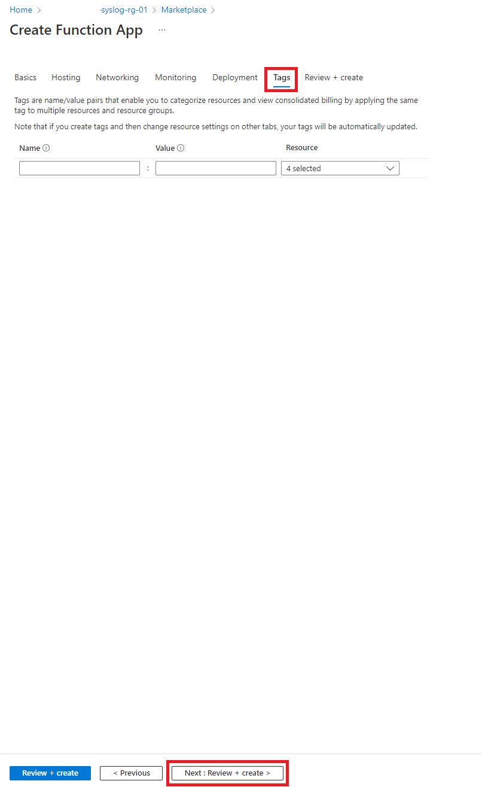
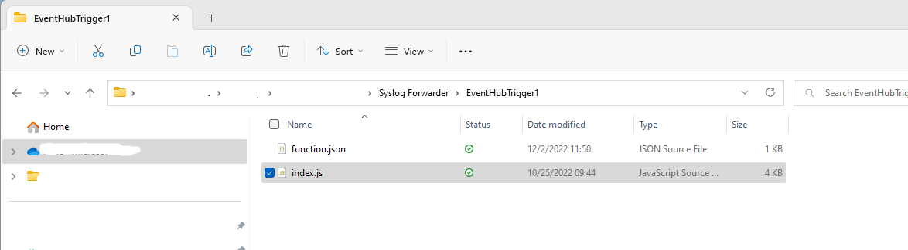
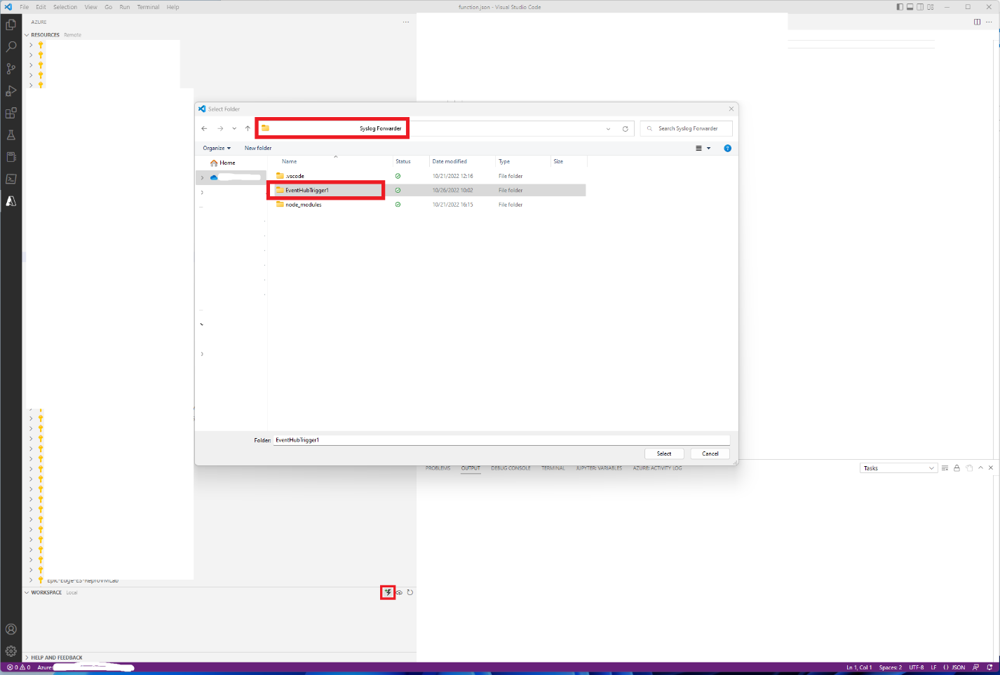
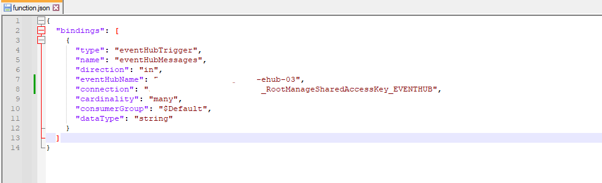

# Azure VMware Solution Syslog Forwarder

**Sourced from this GitHub repository and modified to work with Azure VMware
Solution:** [miguelangelopereira/azuremonitor2syslog: Forward Azure
monitor logs to syslog (via Event Hub)
(github.com)](https://github.com/miguelangelopereira/azuremonitor2syslog)

## Overview

Large enterprise and strategic customers have existing and established
monitoring solutions that are a constraint for adopting new solutions
such as the Azure VMware Solution. Customers do not want to adopt a new
real-time monitoring framework for the Azure VMware Solution. This
Syslog Forwarder function allows a customer to achieve operational
excellence with the Azure VMware Solution and to meet their operations
management goals.

The Azure VMware Solution does not currently support Syslog Forwarding
to a customer Syslog server. This Syslog Forwarder function provides
this capability by streaming Azure VMware Solution Diagnostic logs as a
JSON.string to Azure Event Hub which is then in turn processed by an
Azure Function App to convert the JSON.string into Syslog format and
sent to an external Syslog server.

## Operational Considerations**

This Azure service configuration (Event Hub & Azure Function App) costs
approximately US\$3/day for a single Azure VMware Solution private
cloud.

The Azure Function App is deployed with Visual Studio Code. GitHub is
possible as well but is not covered here.

## How-to Guide**

Prerequisites: Connect Syslog Server (Azure VM or on-premises) to Azure
vNET and ExpressRoute Gateway, if needed.

### Step 1: Create an Azure Event Hub Namespace within the same Azure
Subscription and Azure Region as the Azure VMware Solution private
cloud.

1.  In the Basics tab, select the Azure Subscription, Azure Resource
    Group, Azure Region, Pricing Tier (Standard), Throughput Units (1),
    Auto-Inflate (Enabled), Auto-Inflate Maximum Throughput Units (3)
    and enter the Event Hub Namespace name.

2.  In the Advanced tab, select the Minimum TLS version 1.2 and enable
    Local Authentication.

3.  In the Networking tab, select the Public access Connectivity
    configuration if your corporate security policies allow it.
    Otherwise select Private access (Private endpoint needed).

4.  In the Tags tab, configure any needed tags.

5.  In the Review & Create tab, validate the configuration and create
    the Azure Event Hubs Namespace.

### Step 2: Create an Azure Event Hub within the Azure Event Hub Namespace
from Step 1.

1.  Select the Add Event Hub icon.

2.  In the Basics tab, enter the Event Hub name and set the Partition
    Count (1) and Message Retention (1).

3.  In the Capture tab, set Capture to Off.

4.  In the Review & Create tab, validate the configuration and create
    the Azure Event Hub.

5.  From the Event Hub Namespace Shared access policies, record the
    "RootManagedSharedAccessKey" "Connection string-primary key" which
    will be used in Step 4 to allow the Azure Function to access the
    Event Hub.

### Step 3: Create an Azure Function App within the same Azure Subscription
and Azure Region as the Azure VMware Solution private cloud.

1.  In the Basics tab, select the Azure Subscription, Azure Resource
    Group, Azure Region, Publish (Code), Runtime Stack (Node.js),
    Version (16 LTS), Operating System (Windows), Plan Type (App service
    plan), Pricing Plan (Basic B1) and enter the Function App name.

2.  In the Hosting tab, select Storage Account.

3.  In the Networking tab, network injection is disabled with the Basic
    B1 pricing plan.

4.  In the Monitoring tab, set Enable Application Insights (Yes).

5.  In the Deployment tab, set Continuous Deployment (Disable).

6.  In the Tags tab, configure any needed tags.

7.  In the Review & Create tab, validate the configuration and create
    the Azure Function App.

8.  Use the Azure CLI command "az functionapp update --plan \<new plan\>
    -n "\<functionappname\>" --resource-group "\<resourcegroupname\>" to
    change the Plan Type after the Azure Function App has been built.
    This is necessary if a higher performance tier (e.g. Premium) is
    necessary.

### Step 4: Connect the Azure Function App to the Azure Virtual Network that
has network connectivity to the Syslog server.

1.  Select the VNet integration link from the Networking tab of the
    Function App screen.

2.  In the VNet Integration window, select the Add VNet icon.

3.  In the Add VNet Integration window, select the Azure Subscription,
    Virtual Network and Subnet the Syslog server is connected to and
    select the OK button.

### Step 5: Configure Microsoft Visual Studio Code with the necessary
extensions to deploy code to the Azure Function App.

1.  Open Visual Studio Code, select the Extensions object and make sure
    the following extensions are installed:

    a.  Azure Account: search for this term in the Market place search
        and press the Install button.

    b.  Azure Resources: search for this term in the Market place search
        and press the Install button.

    c.  Azure Functions: search for this term in the Market place search
        and press the Install button.

    d.  NVM for Windows: [coreybutler/nvm-windows: A node.js version
        management utility for Windows. Ironically written in Go.
        (github.com)](https://github.com/coreybutler/nvm-windows#installation--upgrades)

### Step 6: Configure Azure Function App with syslog-forwarding code using
Microsoft Visual Studio Code.

1.  Copy the GitHub repository files to a folder on your Windows
    desktop.

2.  Open Visual Studio Code and select the Create Function icon from the
    Workspace section and then select the folder the GitHub repository
    files were copied to.

3.  In the Create new project field, select the JavaScript language.

4.  In the Create new project field, select the Azure Event Hub trigger
    as the function.

5.  In the Create new Azure Event Hub trigger field, give the function a
    name. e.g. EventHubTrigger1.

6.  In the Create new Azure Event Hub trigger field, select the Create
    new local app setting.

7.  In the Create new Azure Event Hub trigger field, select the Azure
    Function App configured in Step 3.

8.  In the Create new Azure Event Hub trigger field, select the Azure
    Event Hub Namespace configured in Step 1.

9. In the Create new Azure Event Hub trigger field, select the Azure
    Event Hub configured in Step 2.

10. In the Create new Azure Event Hub trigger field, select the Azure
    Event Hub policy configured in Step 1. E.g.
    RootManagedSharedAccessKey.

11. In the Create new Azure Event Hub trigger field, select the Azure
    Event Hub consumer group configured in Step 1. E.g. \$Default.

12. In the Create new project field, select the Open in current window
    option.

13. In the Visual Studio Code popup window, select the Deploy button.

14. Track the deployment status in the Terminal window and by the deploy
    status in the bottom right corner of Visual Studio Code.

15. When deployment is complete, the deploy status in the bottom right
    corner of Visual Studio Code will be marked as completed.

16. If the deployment fails, make sure the syslog-client is installed,
    by typing "npm install syslog-client" in the Terminal window and
    then execute the deploy Azure Function App again by right mouse
    click over the Azure Function App (not the Workspace) and select the
    local folder that contains the GitHub code.

17. From Visual Studio Code, expand the Azure Function App created in
    Step 3, right click the Application Settings folder and select Add
    New Setting. Add the following six settings by repeating this step:

    a.  Name: SYSLOG_FACILITY, Value: \<empty -- will default to value
        in script\>

    b.  Name: SYSLOG_HOSTNAME, Value: \<empty -- will default to value
        in script\>

    c.  Name: SYSLOG_PORT, Value: 514

    d.  Name: SYSLOG_PROTOCOL, Value: TCP

    e.  Name: SYSLOG_SERVER, Value: \<IP address of Syslog server\>

    f.  Name: \<eventhubname\>-RootManageSharedAccessKey_EVENTHUB (this
        needs to match the connection name in the function.json file in
        the local folder), Value: \<Event Hub shared policy primary
        access string from Step 1\>

18. Right click over the Azure Function App and select Restart.

### Step 7: Configure Azure VMware Solution private cloud to forward syslog
messages to Azure Event Hub.

1.  In the Azure VMware Solution Diagnostic settings window, select the
    Add diagnostic setting icon.

2.  In the Add Diagnostic setting window, select the audit and allLogs
    Category groups, select the VMware Syslog Category, select the
    Stream to event hub option and select the Subscription, Event Hub
    Namespace, Event Hub name and Event Hub policy name. Then press the
    Save button.

3.  The Azure VMware Solution syslogs will now start streaming to the
    Syslog server via the Event Hub and Azure Function App.

## Troubleshooting

### Step 8: Troubleshooting Azure Function syslog message processing.

1.  From Visual Studio Code, select the Azure Function App built in Step
    3 and make sure the following items exist:

    a.  Functions folder has an EventHubTrigger object.

    b.  Application settings have the six entries for SYSLOG and Event
        Hub shared access key.

    c.  Files folder has EventHubTrigger function.json, index.js files
        and node_modules has syslog-client folder.

2.  From the Azure portal, select the Azure Event Hub Namespace
    configured in Step 1 and from the Overview page, verify that the
    Messages graph has Incoming and Outgoing Message traffic.

3.  Then select the Azure Function App configured in Step 3 and from the
    Overview page, verify that the Function Execution Count is non-zero.

4.  Then select the Function page of the Azure Function App and select
    the Event Hub Trigger Name.

5.  Then select the Function page of the Azure Function App and select
    the Event Hub Trigger Name. Verify that Invocation Traces exist and
    click on the timestamped trace to view the details.

6.  From the Azure portal, in the Azure Function window, select the
    Console object from the Development Tools section and run the
    "tcpping \<Syslog server IPaddress\>:\<Syslog TCP port\>" command.
    If there is a tcpping response, this means the Azure Function has
    network connectivity to the Syslog server.

## Testing

From a CentOS Linux machine connected to the Azure Virtual Network,
logger can be used to send a test message to the Syslog server: logger
-n \<syslog-server-IP-address\> -t myapp -p user.notice \"TESTING"
